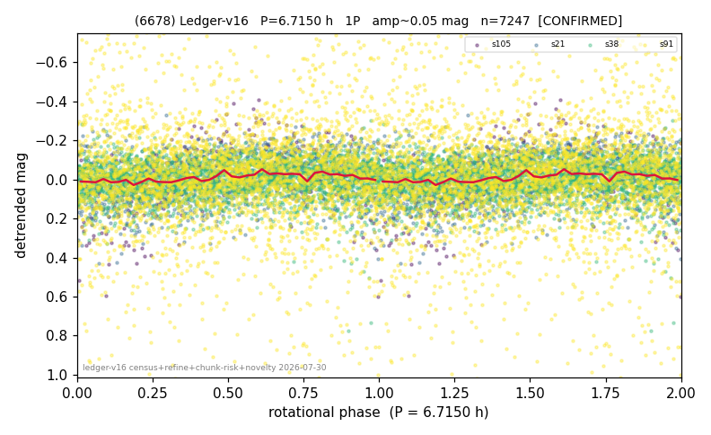

# (6678)

**Adopted:** 6.715 h, 1P, CONFIRMED

<!-- AUTO:START (regenerated from pipeline outputs; do not hand-edit this block) -->
## Evidence (auto)

Detected in 5 sector(s):

| sector | N | baseline (h) | P_phot (h) | power | FAP | cycles | flags |
|--|--|--|--|--|--|--|--|
| s21 | 865 | 646.5 | 6.8304 | 0.6575 | 1.8e-196 | 47.3 | clean |
| s38 | 2731 | 632.5 | 205.1735 | 0.0674 | 3.0e-37 | 3.1 | star-cleaned:12 |
| s73 | 7185 | 633.7 | 6.8323 | 0.1803 | 3.9e-305 | 92.8 | star-cleaned:93,2P-ambiguous |
| s91 | 3412 | 314.0 | 156.995 | 0.1101 | 5.3e-82 | 2.0 | star-cleaned:142,grid-edge,phase-curve-r |
| s105 | 284 | 18.3 | 6.6005 | 0.3374 | 4.3e-22 | 2.8 | phase-curve-risk,2P-untestable,2P-ambigu |

- Pipeline refine said: **1P** (folded amp_fourier 0.345); flags: phase-curve-risk:1/2-sectors
- DIA (de-comb): not triggered (the object is clean, fast and non-comb, so the test does not apply)
- Coverage: **4 sector(s)**, best sector covers **96.28 cycles** of the adopted period. Measured periodogram peak width 1% of the period, i.e. about **+/- 0.01947 h** (1 sigma); the decimal places in the adopted value are not a precision claim.
- Factor of two: no doubling was applied.
- Gates: FAP<1e-3 and power>=0.10 per detecting sector; >=2 sectors agree (harmonic-aware).
- Adopted shape: **1P** (folded-amplitude rule; pipeline agrees).

### Why this row reads the way it does

- 2 sector(s) detecting
- cross-sector fold correlation 0.75
- single-peaked at folded amp 0.345 mag

<!-- AUTO:END -->
