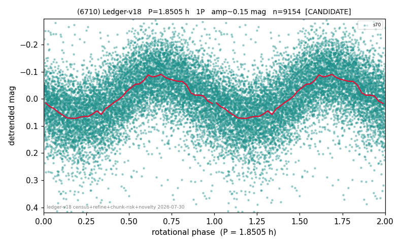

# (6710)

**Adopted:** 1.8505 h, 1P, CANDIDATE

<!-- AUTO:START (regenerated from pipeline outputs; do not hand-edit this block) -->
## Evidence (auto)

Detected in 1 sector(s):

| sector | N | baseline (h) | P_phot (h) | power | FAP | cycles | flags |
|--|--|--|--|--|--|--|--|
| s70 | 9168 | 595.4 | 1.8505 | 0.3017 | 0.0e+00 | 321.7 | star-cleaned:27,2P-ambiguous |

- Pipeline refine said: **1P** (folded amp_fourier 0.162); flags: sick-dips-excised:s70(14)
- DIA (de-comb): not triggered (clean, fast, non-comb)
- Gates: FAP<1e-3 and power>=0.10 per detecting sector; single strong sector (candidate ceiling).
- Adopted shape: **1P** (folded-amplitude rule; pipeline agrees).

### Why this row reads the way it does

- 1 sector(s) detecting
- single-peaked at folded amp 0.162 mag
- CHUNK QUARANTINE (AMP_DOMINATED): the stitching steps applied between chunks are LARGER than the object's own folded amplitude, so any fold shape may be an artefact. Needs a direct re-extraction before this period can be claimed

<!-- AUTO:END -->
