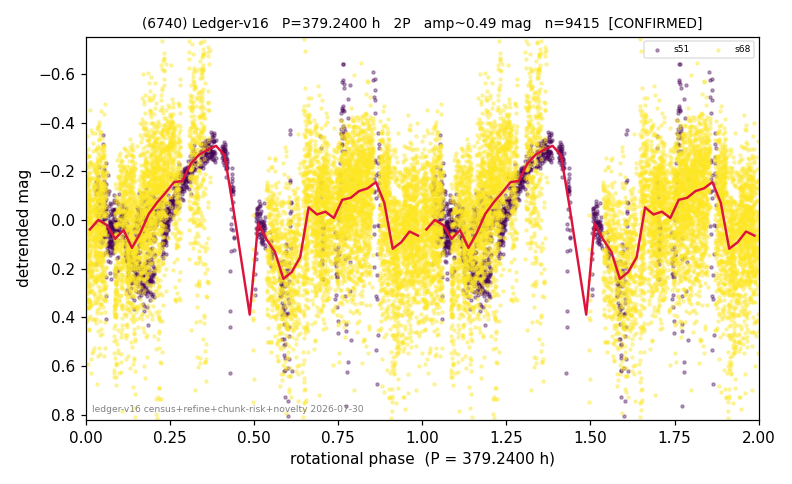

# (6740)

**Adopted:** 189.62 h, ambiguous, CANDIDATE

<!-- AUTO:START (regenerated from pipeline outputs; do not hand-edit this block) -->
## Evidence (auto)

Detected in 2 sector(s):

| sector | N | baseline (h) | P_phot (h) | power | FAP | cycles | flags |
|--|--|--|--|--|--|--|--|
| s51 | 1471 | 586.3 | 188.0814 | 0.5365 | 8.7e-241 | 3.1 | star-cleaned:15,2P-untestable,2P-ambiguo |
| s68 | 7973 | 606.6 | 191.1585 | 0.1704 | 2.6e-318 | 3.2 | star-cleaned:132,2P-untestable,2P-ambigu |

- Pipeline refine said: **2P** (folded amp_fourier 0.536); flags: few-cycle:1.6;gap-alias-risk:91h;sick-dips-excised:s51(14),s68(15)
- DIA (de-comb): not triggered (clean, fast, non-comb)
- Gates: FAP<1e-3 and power>=0.10 per detecting sector; single strong sector (candidate ceiling).
- **Adopted shape ambiguous OVERRIDES the pipeline's 2P** (doubling audit 2026-07-25: folded amplitude >= 0.25 mag, so a single-peaked curve is physically implausible; Harris convention -> ambiguous. The census 3-test doubling logic was measured at only 30% recall against 289 LCDB U>=2 ground-truth periods).

### Why this row reads the way it does

- 2 sector(s) detecting, P_phot 188.08/191.16 h agree to 1.6% (FAP 1e-241, 1e-318): the ~190 h photometric period is solid
- DOWNGRADED from CONFIRMED 379.24 h 2P on 2026-08-01 review: the doubling had NO shape evidence (odd-harmonic 1.0 and 0.4 sigma, unequal minima in 1 of 2 sectors) and rested on the Harris amplitude convention alone, while the curve shows day-long BRIGHTENING BURSTS (e.g. s51 day 10: 73 of 105 points >0.3 mag bright; s68 days 0/18/24) not explained by common-mode windows (31 of 625 points), by star proximity (b=-59 deg, corr with star density -0.20) or by photon statistics; the bursts contaminate the very amplitude the doubling convention relies on, so the shape is AMBIGUOUS and 189.62 h (1P reading) is adopted
- each sector covers only ~3 cycles at 190 h (peak width ~60 h)

<!-- AUTO:END -->
