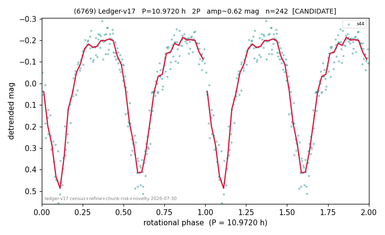

# (6769)

**Adopted:** 10.972 h, 2P, CONFIRMED

<!-- AUTO:START (regenerated from pipeline outputs; do not hand-edit this block) -->
## Evidence (auto)

Detected in 1 sector(s):

| sector | N | baseline (h) | P_phot (h) | power | FAP | cycles | flags |
|--|--|--|--|--|--|--|--|
| s44 | 242 | 43.3 | 5.486 | 0.8063 | 8.9e-82 | 7.9 | 2P-ambiguous |

- Pipeline refine said: **2P** (folded amp_fourier 0.566); flags: few-cycle:3.9
- DIA (de-comb): not triggered (the object is clean, fast and non-comb, so the test does not apply)
- Coverage: **0 sector(s)**.
- Factor of two: **adopted on the amplitude convention**: standard practice for an elongated body, but a convention rather than a measurement.
- Gates: FAP<1e-3 and power>=0.10 per detecting sector; >=2 sectors agree (harmonic-aware).
- Adopted shape: **2P** (folded-amplitude rule; pipeline agrees).

### Why this row reads the way it does

- 1 sector(s) detecting
- doubling BY CONVENTION: amplitude rule on folded amp 0.566 mag, not individually audited
- pipeline flag: few-cycle
- PROMOTED CANDIDATE->CONFIRMED 2026-08-15 (TESS+ZTF joint, the user-blessed pathway): independent ZTF blind Lomb-Scargle over 5.8 yr / 318 g+r points recovers 5.4756 h = TESS-P/2 5.4860h to 0.19%, power 0.709, trials-corrected FAP 2.4e-79, beating every alias/comb candidate (comb n=60 5.480h at 0.679); a ZTF detection cannot be a TESS comb tooth or TESS red noise, so this is a genuine second realization and the single-sector ceiling no longer applies

<!-- AUTO:END -->
