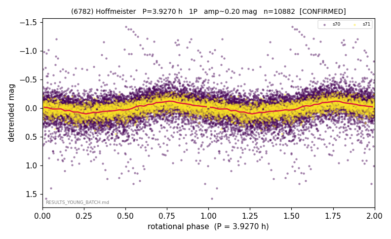

# (6782)

**Adopted:** 7.854 h, 2P, CONFIRMED

<!-- AUTO:START (regenerated from pipeline outputs; do not hand-edit this block) -->
## Evidence (auto)

Detected in 2 sector(s):

| sector | N | baseline (h) | P_phot (h) | power | FAP | cycles | flags |
|--|--|--|--|--|--|--|--|
| s70 | 7968 | 581.6 | 3.9279 | 0.1378 | 1.6e-251 | 148.1 | star-cleaned:213,2P-ambiguous |
| s71 | 2933 | 180.7 | 3.9266 | 0.3137 | 5.9e-235 | 46.0 | 2P-ambiguous |

- Pipeline refine said: **1P** (folded amp_fourier 0.243); flags: sick-dips-excised:s70(19)
- DIA (de-comb): survived_v2(ret=1.000[1.00-1.00],s71@3.927h)
- Coverage: **2 sector(s)**, best sector covers **148.11 cycles** of the adopted period. Measured periodogram peak width 1% of the period, i.e. about **+/- 0.01051 h** (1 sigma); the decimal places in the adopted value are not a precision claim.
- Factor of two: no doubling was applied.
- Gates: FAP<1e-3 and power>=0.10 per detecting sector; >=2 sectors agree (harmonic-aware).
- **Adopted shape 2P OVERRIDES the pipeline's 1P** (doubling audit 2026-07-25: folded amplitude >= 0.25 mag, so a single-peaked curve is physically implausible; Harris convention -> 2P. The census 3-test doubling logic was measured at only 30% recall against 289 LCDB U>=2 ground-truth periods).

### Why this row reads the way it does

- census amp 0.96 was blend event; real 0.20
- DOUBLING CORRECTED 2026-08-30: adopted period doubled from 3.927 h. The previous value came from the folded-amplitude rule, which was found biased low (9 of 9 disagreements with MPB 2024-2026 in the same direction). Odd-harmonic test at the long period gives z1=4.2 with margin 2.08 over non-harmonic multiples 1.7x/2.3x (reference group: 0 of 38 above margin 2).

<!-- AUTO:END -->
