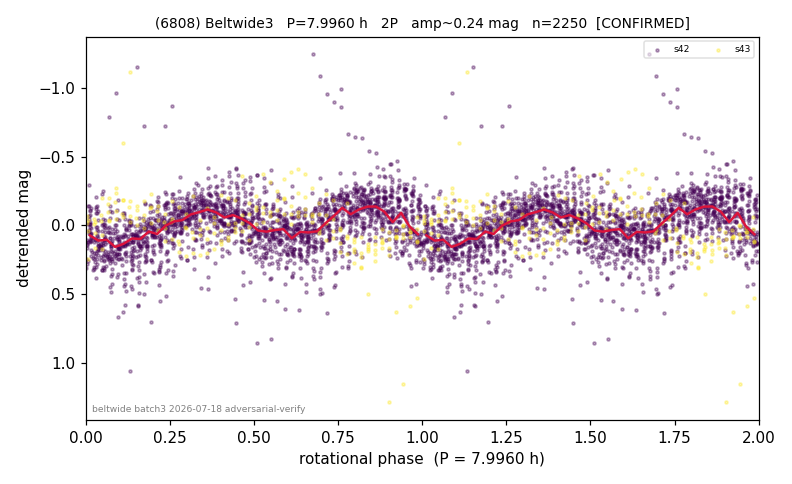

# (6808)

**Adopted:** 7.996 h, 2P, CONFIRMED

<!-- AUTO:START (regenerated from pipeline outputs; do not hand-edit this block) -->
## Evidence (auto)

Detected in 2 sector(s):

| sector | N | baseline (h) | P_phot (h) | power | FAP | cycles | flags |
|--|--|--|--|--|--|--|--|
| s42 | 2041 | 596.7 | 3.9886 | 0.4014 | 1.1e-222 | 74.8 | star-cleaned:82 |
| s43 | 209 | 34.7 | 4.0068 | 0.4066 | 1.8e-20 | 8.7 | star-cleaned:7,2P-ambiguous |

- Refined shape: **1P** (folded amp_fourier 0.364); flags: sick-dips-excised:s43(4);near-threshold:0.36
- DIA (de-comb): survived(dPW=-6%,R2=0.44,s43@3.998h,3sec)
- Gates: FAP<1e-3 and power>=0.10 per detecting sector; >=2 sectors agree (harmonic-aware); folded-amplitude rule -> 2P.

<!-- AUTO:END -->

## Reasoning
Base 4.0 h doubled; consecutive s42/s43 agree 0.44%. DIA: survives at 3.998 h = P/2 in both sectors (the 8 h-alias 'kill' in the first rescan was a weak-alias false positive fixed by the survival-first rule).
## Verdict
CONFIRMED 2P / 7.996 h.
