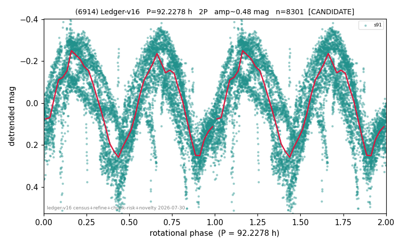

# (6914)

**Adopted:** 92.2278 h, 2P, CONFIRMED

<!-- AUTO:START (regenerated from pipeline outputs; do not hand-edit this block) -->
## Evidence (auto)

Detected in 1 sector(s):

| sector | N | baseline (h) | P_phot (h) | power | FAP | cycles | flags |
|--|--|--|--|--|--|--|--|
| s91 | 8318 | 621.5 | 46.1139 | 0.5833 | 0.0e+00 | 13.5 | star-cleaned:41,2P-ambiguous |

- Pipeline refine said: **2P** (folded amp_fourier 0.436); flags: near-comb(amp-cleared):n=7;gap-alias-risk:99h;sick-dips-excised:s91(5);near-threshold:0.44
- DIA (de-comb): survived(dPW=+1%,R2=0.04,s91@46.114h,1sec)
- Coverage: **1 sector(s)**, best sector covers **6.74 cycles** of the adopted period. Measured periodogram peak width 6% of the period, i.e. about **+/- 1.203 h** (1 sigma); the decimal places in the adopted value are not a precision claim.
- Factor of two: **adopted on the amplitude convention**: standard practice for an elongated body, but a convention rather than a measurement.
- Gates: FAP<1e-3 and power>=0.10 per detecting sector; >=2 sectors agree (harmonic-aware).
- Adopted shape: **2P** (folded-amplitude rule; pipeline agrees).

### Why this row reads the way it does

- 1 sector(s) detecting
- doubling BY CONVENTION: amplitude rule on folded amp 0.436 mag, not individually audited
- PROMOTED CANDIDATE->CONFIRMED 2026-08-15 (TESS+ZTF joint, the user-blessed pathway): independent ZTF blind Lomb-Scargle over 6.6 yr / 363 g+r points recovers 46.2279 h = TESS-P/2 46.1139h to 0.25%, power 0.531, trials-corrected FAP 3.4e-54, beating every alias/comb candidate (alias 15.7848h at 0.525); a ZTF detection cannot be a TESS comb tooth or TESS red noise, so this is a genuine second realization and the single-sector ceiling no longer applies
- ZTF ALIAS CAVEAT (adversarial review 2026-08-16): injection tests on the real, night-block-permuted residuals leave a 5-20% probability that the ZTF blind peak picks the wrong member of the +-1 cycle/day alias family (SNR below the sample median). The period value is fixed by TESS, which has no diurnal window; ZTF confirms that a signal of this frequency family is present across apparitions

<!-- AUTO:END -->
