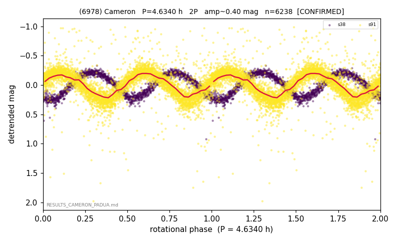

# (6978)

**Adopted:** 4.634 h, 2P, CONFIRMED

<!-- AUTO:START (regenerated from pipeline outputs; do not hand-edit this block) -->
## Evidence (auto)

Detected in 2 sector(s):

| sector | N | baseline (h) | P_phot (h) | power | FAP | cycles | flags |
|--|--|--|--|--|--|--|--|
| s38 | 1658 | 366.2 | 2.3171 | 0.9153 | 0.0e+00 | 158.0 | 2P-ambiguous |
| s91 | 4580 | 554.8 | 2.3163 | 0.6571 | 0.0e+00 | 239.5 | star-cleaned:92,2P-ambiguous |

- Refined shape: **2P** (folded amp_fourier 0.477); flags: sector-dropped:s91(range>3mag);sick-dips-excised:s38(1)
- DIA (de-comb): survived(dPW=+1%,R2=0.03,s38@2.317h,2sec)
- Gates: FAP<1e-3 and power>=0.10 per detecting sector; >=2 sectors agree (harmonic-aware); folded-amplitude rule -> 2P.

<!-- AUTO:END -->
