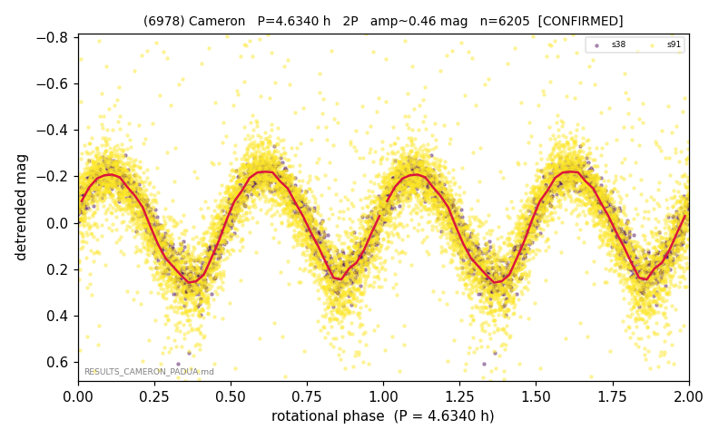

# (6978)

**Adopted:** 4.634 h, 2P, CONFIRMED

<!-- AUTO:START (regenerated from pipeline outputs; do not hand-edit this block) -->
## Evidence (auto)

Detected in 2 sector(s):

| sector | N | baseline (h) | P_phot (h) | power | FAP | cycles | flags |
|--|--|--|--|--|--|--|--|
| s38 | 1658 | 366.2 | 2.3171 | 0.9153 | 0.0e+00 | 158.0 | 2P-ambiguous |
| s91 | 4580 | 554.8 | 2.3163 | 0.6571 | 0.0e+00 | 239.5 | star-cleaned:92,2P-ambiguous |

- Pipeline refine said: **2P** (folded amp_fourier 0.49); flags: sick-dips-excised:s38(1),s91(32)
- DIA (de-comb): survived(dPW=+1%,R2=0.03,s38@2.317h,2sec)
- Coverage: **2 sector(s)**, best sector covers **119.73 cycles** of the adopted period. Measured periodogram peak width 0% of the period, i.e. about **+/- 0.004133 h** (1 sigma); the decimal places in the adopted value are not a precision claim.
- Factor of two: **adopted on the amplitude convention**: standard practice for an elongated body, but a convention rather than a measurement.
- Gates: FAP<1e-3 and power>=0.10 per detecting sector; >=2 sectors agree (harmonic-aware).
- Adopted shape: **2P** (folded-amplitude rule; pipeline agrees).

### Why this row reads the way it does

- base 2.317h matched 0.0086% across 4-yr gap; amp 0.499>0.40 doubling; S91 contamination flagged non-fatal
- 2P by amplitude rule (folded_amp=0.490)

<!-- AUTO:END -->
