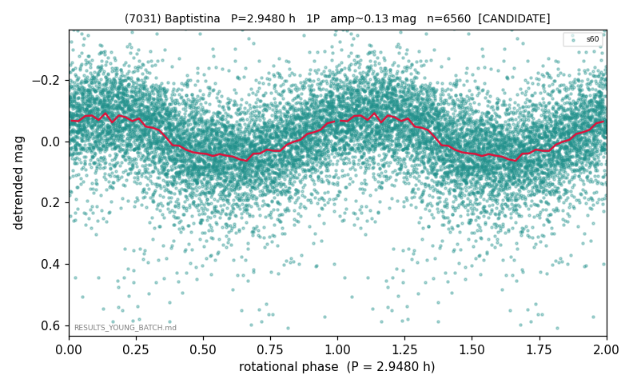

# (7031)

**Adopted:** 2.948 h, 1P, CANDIDATE

<!-- AUTO:START (regenerated from pipeline outputs; do not hand-edit this block) -->
## Evidence (auto)

Detected in 1 sector(s):

| sector | N | baseline (h) | P_phot (h) | power | FAP | cycles | flags |
|--|--|--|--|--|--|--|--|
| s60 | 6580 | 611.7 | 2.9483 | 0.1788 | 2.5e-276 | 207.5 | star-cleaned:22,2P-ambiguous |

- Pipeline refine said: **1P** (folded amp_fourier 0.172); flags: sick-dips-excised:s60(16)
- DIA (de-comb): survived_v2(ret=0.997[0.99-1.00],s60@2.948h)
- Coverage: **1 sector(s)**, best sector covers **207.51 cycles** of the adopted period. Measured periodogram peak width 0% of the period, i.e. about **+/- 0.005259 h** (1 sigma); the decimal places in the adopted value are not a precision claim.
- Factor of two: no doubling was applied.
- Gates: FAP<1e-3 and power>=0.10 per detecting sector; single strong sector (candidate ceiling).
- Adopted shape: **1P** (folded-amplitude rule; pipeline agrees).

### Why this row reads the way it does

- weak: real amp only 0.05

<!-- AUTO:END -->
