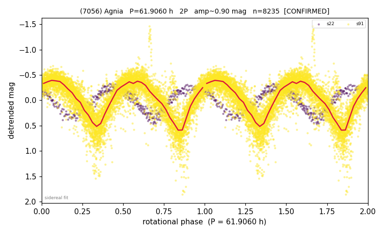

# (7056)

**Adopted:** 61.906 h, 2P, CONFIRMED

<!-- AUTO:START (regenerated from pipeline outputs; do not hand-edit this block) -->
## Evidence (auto)

Detected in 2 sector(s):

| sector | N | baseline (h) | P_phot (h) | power | FAP | cycles | flags |
|--|--|--|--|--|--|--|--|
| s22 | 388 | 217.5 | 30.9286 | 0.8873 | 1.2e-178 | 7.0 | 2P-ambiguous |
| s91 | 7847 | 595.3 | 30.9777 | 0.6978 | 0.0e+00 | 19.2 | star-cleaned:1,2P-ambiguous |

- Refined shape: **2P** (folded amp_fourier 0.598); flags: few-cycle:3.5;sector-dropped:s91(range>3mag)
- DIA (de-comb): survived(dPW=+0%,R2=0.03,s22@30.953h,3sec)
- Gates: FAP<1e-3 and power>=0.10 per detecting sector; >=2 sectors agree (harmonic-aware); folded-amplitude rule -> 2P.

<!-- AUTO:END -->
