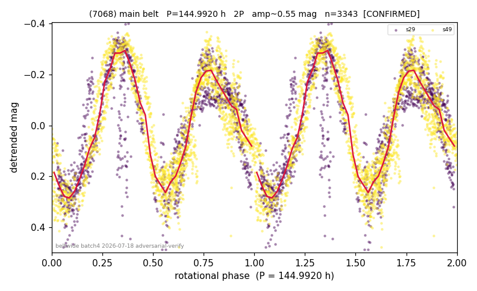

# (7068)

**Adopted:** 144.992 h, 2P, CONFIRMED

<!-- AUTO:START (regenerated from pipeline outputs; do not hand-edit this block) -->
## Evidence (auto)

Detected in 2 sector(s):

| sector | N | baseline (h) | P_phot (h) | power | FAP | cycles | flags |
|--|--|--|--|--|--|--|--|
| s29 | 1330 | 299.7 | 72.9116 | 0.7101 | 0.0e+00 | 4.1 | 2P-ambiguous |
| s49 | 2020 | 520.8 | 72.0803 | 0.754 | 0.0e+00 | 7.2 | 2P-ambiguous |

- Pipeline refine said: **2P** (folded amp_fourier 0.575); flags: few-cycle:3.6;gap-alias-risk:99h;sick-dips-excised:s29(6)
- DIA (de-comb): survived(dPW=+0%,R2=0.15,s49@72.496h,2sec)
- Coverage: **2 sector(s)**, best sector covers **3.59 cycles** of the adopted period. Measured periodogram peak width 11% of the period, i.e. about **+/- 3.427 h** (1 sigma); the decimal places in the adopted value are not a precision claim.
- Factor of two: **adopted on the amplitude convention**: standard practice for an elongated body, but a convention rather than a measurement.
- Gates: FAP<1e-3 and power>=0.10 per detecting sector; >=2 sectors agree (harmonic-aware).
- Adopted shape: **2P** (folded-amplitude rule; pipeline agrees).

### Why this row reads the way it does

- DOUBLED 1P->2P 72.496->144.992h (high-amp 1P audit 2026-07-18: folded amp 0.475 = elongated/double-peaked; house rule amp>0.40->2P). Independent error-weighted LS recovers essentially the same period in both sectors (s29: 72.91h, power 0.71, FAP~0; s

<!-- AUTO:END -->
