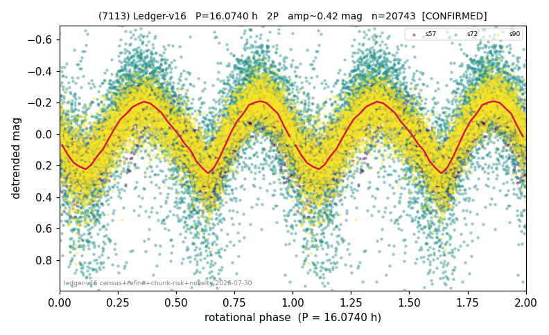

# (7113)

**Adopted:** 16.074 h, 2P, CONFIRMED

<!-- AUTO:START (regenerated from pipeline outputs; do not hand-edit this block) -->
## Evidence (auto)

Detected in 3 sector(s):

| sector | N | baseline (h) | P_phot (h) | power | FAP | cycles | flags |
|--|--|--|--|--|--|--|--|
| s57 | 7001 | 578.3 | 8.0365 | 0.7438 | 0.0e+00 | 72.0 | 2P-ambiguous |
| s72 | 6664 | 565.8 | 8.0399 | 0.2912 | 0.0e+00 | 70.4 | star-cleaned:189,2P-ambiguous |
| s90 | 7146 | 485.6 | 8.0368 | 0.5789 | 0.0e+00 | 60.4 | star-cleaned:1,2P-ambiguous |

- Pipeline refine said: **2P** (folded amp_fourier 0.43); flags: amp-from-clean-sectors(ignored s72);sick-dips-excised:s72(17),s90(5);near-threshold:0.43
- DIA (de-comb): **NOT RUN for this lot.** No de-comb verdict exists for this object, so momentum-dump contamination has not been excluded by that test here.
- Gates: FAP<1e-3 and power>=0.10 per detecting sector; >=2 sectors agree (harmonic-aware).
- Adopted shape: **2P** (folded-amplitude rule; pipeline agrees).

### Why this row reads the way it does

- 3 sector(s) detecting
- cross-sector fold correlation 0.98
- doubling BY CONVENTION: amplitude rule on folded amp 0.430 mag, not individually audited

<!-- AUTO:END -->
