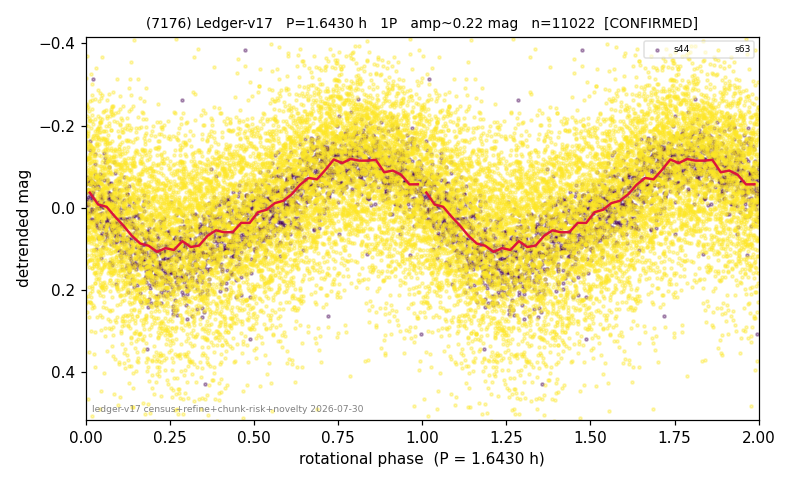

# (7176)

**Adopted:** 3.286 h, 2P, CONFIRMED

<!-- AUTO:START (regenerated from pipeline outputs; do not hand-edit this block) -->
## Evidence (auto)

Detected in 2 sector(s):

| sector | N | baseline (h) | P_phot (h) | power | FAP | cycles | flags |
|--|--|--|--|--|--|--|--|
| s44 | 2106 | 474.9 | 1.6435 | 0.5525 | 0.0e+00 | 288.9 | star-cleaned:21,2P-ambiguous |
| s63 | 8939 | 615.4 | 1.6429 | 0.2039 | 0.0e+00 | 374.6 | star-cleaned:30,2P-ambiguous |

- Pipeline refine said: **1P** (folded amp_fourier 0.25); flags: sick-dips-excised:s44(11),s63(9)
- DIA (de-comb): survived(dPW=+9%,R2=0.43,s44@1.643h,2sec)
- Coverage: **2 sector(s)**, best sector covers **187.29 cycles** of the adopted period. Measured periodogram peak width 0% of the period, i.e. about **+/- 0.0 h** (1 sigma); the decimal places in the adopted value are not a precision claim.
- Factor of two: **measured on the data** (odd-harmonic power or unequal minima, significant and reproduced), METHODOLOGY 3b.
- Gates: FAP<1e-3 and power>=0.10 per detecting sector; >=2 sectors agree (harmonic-aware).
- **Adopted shape 2P OVERRIDES the pipeline's 1P** (doubling audit 2026-07-25: folded amplitude >= 0.25 mag, so a single-peaked curve is physically implausible; Harris convention -> 2P. The census 3-test doubling logic was measured at only 30% recall against 289 LCDB U>=2 ground-truth periods).

### Why this row reads the way it does

- 2 sector(s) detecting
- cross-sector fold correlation 0.95
- single-peaked at folded amp 0.250 mag
- CORRECTED 1.643->3.2860 h (2026-08-01 sub-barrier sweep): all 49 catalog periods below 2.2 h sat on 5-16 km bodies, impossible as true rotations; doubling MEASURED in the 2026-08-01 fast-rotator re-audit: odd-harmonic 1.56 sigma (1/2 sectors), minima z=2.57

<!-- AUTO:END -->
