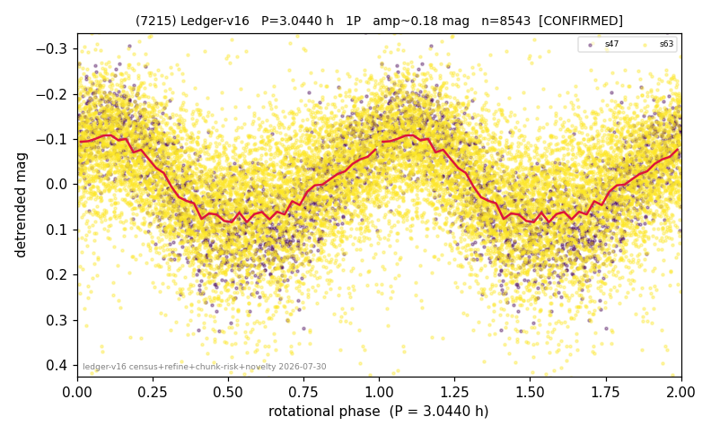

# (7215)

**Adopted:** 3.044 h, 1P, CONFIRMED

<!-- AUTO:START (regenerated from pipeline outputs; do not hand-edit this block) -->
## Evidence (auto)

Detected in 2 sector(s):

| sector | N | baseline (h) | P_phot (h) | power | FAP | cycles | flags |
|--|--|--|--|--|--|--|--|
| s47 | 1779 | 446.2 | 3.0437 | 0.6252 | 0.0e+00 | 146.6 | 2P-ambiguous |
| s63 | 6769 | 478.1 | 3.0442 | 0.2233 | 0.0e+00 | 78.5 | star-cleaned:121 |

- Pipeline refine said: **1P** (folded amp_fourier 0.262); flags: sick-dips-excised:s63(1)
- DIA (de-comb): not triggered (clean, fast, non-comb)
- Gates: FAP<1e-3 and power>=0.10 per detecting sector; >=2 sectors agree (harmonic-aware).
- Adopted shape: **1P** (folded-amplitude rule; pipeline agrees).

### Why this row reads the way it does

- 2 sector(s) detecting
- cross-sector fold correlation 0.93
- single-peaked at folded amp 0.262 mag

<!-- AUTO:END -->
