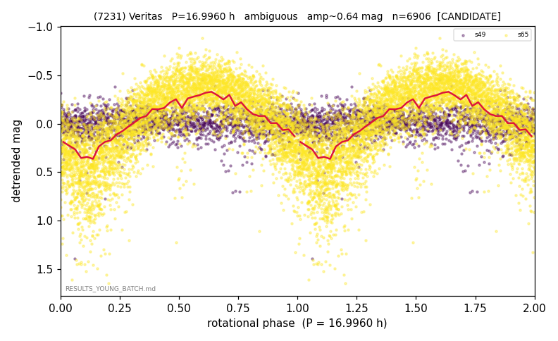

# (7231)

**Adopted:** 16.996 h, ambiguous, CANDIDATE

<!-- AUTO:START (regenerated from pipeline outputs; do not hand-edit this block) -->
## Evidence (auto)

Detected in 2 sector(s):

| sector | N | baseline (h) | P_phot (h) | power | FAP | cycles | flags |
|--|--|--|--|--|--|--|--|
| s49 | 1764 | 450.0 | 30.5846 | 0.0263 | 1.7e-06 | 14.7 | star-cleaned:4 |
| s65 | 5142 | 387.6 | 16.9955 | 0.5595 | 0.0e+00 | 22.8 | 2P-ambiguous |

- Refined shape: **2P** (folded amp_fourier 0.816); flags: near-comb(amp-cleared):n=10;sick-dips-excised:s65(11)
- DIA (de-comb): survived(dPW=+0%,R2=0.00,s65@16.995h,3sec)
- Gates: FAP<1e-3 and power>=0.10 per detecting sector; single strong sector (candidate ceiling); folded-amplitude rule -> ambiguous.

<!-- AUTO:END -->
