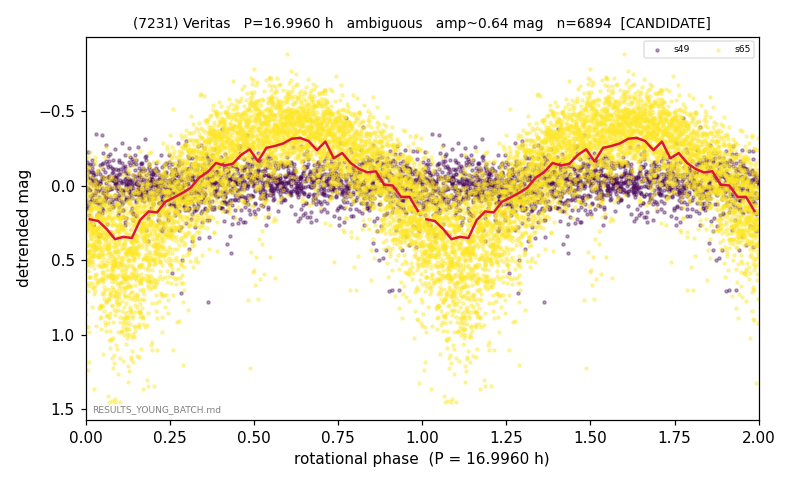

# (7231)

**Adopted:** 16.996 h, ambiguous, CANDIDATE

<!-- AUTO:START (regenerated from pipeline outputs; do not hand-edit this block) -->
## Evidence (auto)

Detected in 2 sector(s):

| sector | N | baseline (h) | P_phot (h) | power | FAP | cycles | flags |
|--|--|--|--|--|--|--|--|
| s49 | 1764 | 450.0 | 30.5846 | 0.0263 | 1.7e-06 | 14.7 | star-cleaned:4 |
| s65 | 5142 | 387.6 | 16.9955 | 0.5595 | 0.0e+00 | 22.8 | 2P-ambiguous |

- Pipeline refine said: **2P** (folded amp_fourier 0.816); flags: near-comb(amp-cleared):n=10;sick-dips-excised:s65(11)
- DIA (de-comb): survived(dPW=+0%,R2=0.00,s65@16.995h,3sec)
- Coverage: **2 sector(s)**, best sector covers **26.48 cycles** of the adopted period. Measured periodogram peak width 4% of the period, i.e. about **+/- 0.28 h** (1 sigma); the decimal places in the adopted value are not a precision claim.
- Factor of two: no doubling was applied.
- Gates: FAP<1e-3 and power>=0.10 per detecting sector; single strong sector (candidate ceiling).
- **Adopted shape ambiguous OVERRIDES the pipeline's 2P** (doubling audit 2026-07-25: folded amplitude >= 0.25 mag, so a single-peaked curve is physically implausible; Harris convention -> ambiguous. The census 3-test doubling logic was measured at only 30% recall against 289 LCDB U>=2 ground-truth periods).

### Why this row reads the way it does

- 34h 2P KILLED (comb n=10); base real; doubling unresolved (amp unstable between sectors)

<!-- AUTO:END -->
