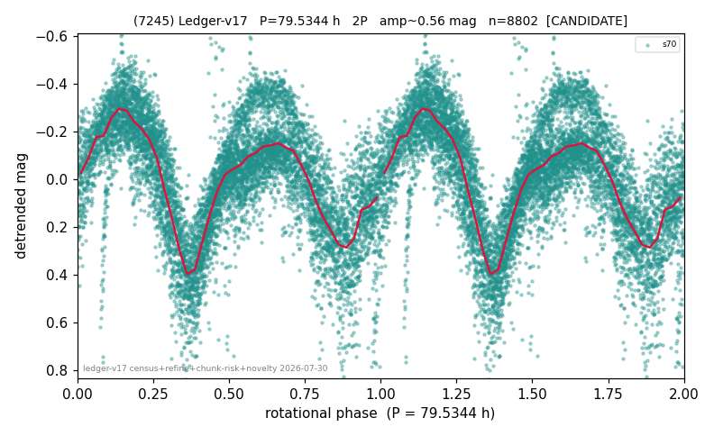

# (7245)

**Adopted:** 79.5344 h, 2P, CANDIDATE

<!-- AUTO:START (regenerated from pipeline outputs; do not hand-edit this block) -->
## Evidence (auto)

Detected in 1 sector(s):

| sector | N | baseline (h) | P_phot (h) | power | FAP | cycles | flags |
|--|--|--|--|--|--|--|--|
| s70 | 8874 | 591.3 | 39.7672 | 0.5488 | 0.0e+00 | 7.4 | star-cleaned:109 |

- Pipeline refine said: **2P** (folded amp_fourier 0.563); flags: near-comb(amp-cleared):n=4,8;gap-alias-risk:56h;sick-dips-excised:s70(56)
- DIA (de-comb): not triggered (clean, fast, non-comb)
- Gates: FAP<1e-3 and power>=0.10 per detecting sector; single strong sector (candidate ceiling).
- Adopted shape: **2P** (folded-amplitude rule; pipeline agrees).

### Why this row reads the way it does

- 1 sector(s) detecting
- doubling BY CONVENTION: amplitude rule on folded amp 0.563 mag, not individually audited
- CHUNK QUARANTINE (SUPPRESSED): the adopted period is at least half the extraction chunk span, and median-matching the chunks removes variation slower than one chunk. Needs a direct re-extraction before this period can be claimed

<!-- AUTO:END -->
