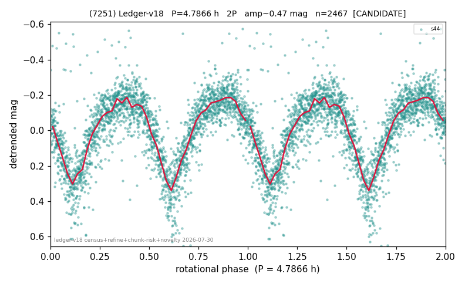

# (7251)

**Adopted:** 4.7866 h, 2P, CONFIRMED

<!-- AUTO:START (regenerated from pipeline outputs; do not hand-edit this block) -->
## Evidence (auto)

Detected in 1 sector(s):

| sector | N | baseline (h) | P_phot (h) | power | FAP | cycles | flags |
|--|--|--|--|--|--|--|--|
| s44 | 2481 | 580.8 | 2.3933 | 0.4957 | 0.0e+00 | 242.7 | star-cleaned:13,2P-ambiguous |

- Pipeline refine said: **2P** (folded amp_fourier 0.464); flags: sick-dips-excised:s44(1)
- DIA (de-comb): survived(dPW=+9%,R2=0.40,s44@2.393h,2sec)
- Coverage: **1 sector(s)**, best sector covers **121.35 cycles** of the adopted period. Measured periodogram peak width 0% of the period, i.e. about **+/- 0.004269 h** (1 sigma); the decimal places in the adopted value are not a precision claim.
- Factor of two: **adopted on the amplitude convention**: standard practice for an elongated body, but a convention rather than a measurement.
- Gates: FAP<1e-3 and power>=0.10 per detecting sector; >=2 sectors agree (harmonic-aware).
- Adopted shape: **2P** (folded-amplitude rule; pipeline agrees).

### Why this row reads the way it does

- 1 sector(s) detecting
- doubling BY CONVENTION: amplitude rule on folded amp 0.464 mag, not individually audited
- PROMOTED CANDIDATE->CONFIRMED 2026-08-15 (TESS+ZTF joint, the user-blessed pathway): independent ZTF blind Lomb-Scargle over 5.7 yr / 341 g+r points recovers 2.3932 h = TESS-P/2 2.3933h to 0.00%, power 0.665, trials-corrected FAP 3.8e-75, beating every alias/comb candidate (alias 2.1763h at 0.587); a ZTF detection cannot be a TESS comb tooth or TESS red noise, so this is a genuine second realization and the single-sector ceiling no longer applies
- NOVELTY CONFIRMATION (2026-08-16 cross-match against catalogues the ledger could not see): Sergeyev+2025 (K2) publishes 4.9153h. NOT a first determination; the paper must present it as such

<!-- AUTO:END -->
