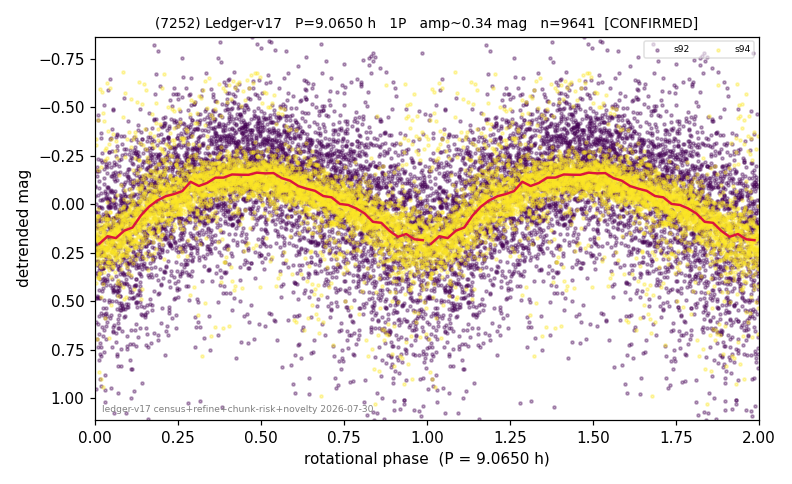

# (7252)

**Adopted:** 9.065 h, 1P, CONFIRMED

<!-- AUTO:START (regenerated from pipeline outputs; do not hand-edit this block) -->
## Evidence (auto)

Detected in 2 sector(s):

| sector | N | baseline (h) | P_phot (h) | power | FAP | cycles | flags |
|--|--|--|--|--|--|--|--|
| s92 | 5493 | 446.9 | 9.0764 | 0.1704 | 6.5e-218 | 49.2 | star-cleaned:64,2P-ambiguous |
| s94 | 4242 | 332.1 | 9.0545 | 0.4063 | 0.0e+00 | 18.3 | star-cleaned:42 |

- Pipeline refine said: **1P** (folded amp_fourier 0.351); flags: amp-from-clean-sectors(ignored s92);sick-dips-excised:s92(8),s94(53);near-threshold:0.35
- DIA (de-comb): survived(dPW=-5%,R2=0.08,s94@9.065h,3sec)
- Gates: FAP<1e-3 and power>=0.10 per detecting sector; >=2 sectors agree (harmonic-aware).
- Adopted shape: **1P** (folded-amplitude rule; pipeline agrees).

### Why this row reads the way it does

- 2 sector(s) detecting
- cross-sector fold correlation 0.98
- single-peaked at folded amp 0.351 mag

<!-- AUTO:END -->
