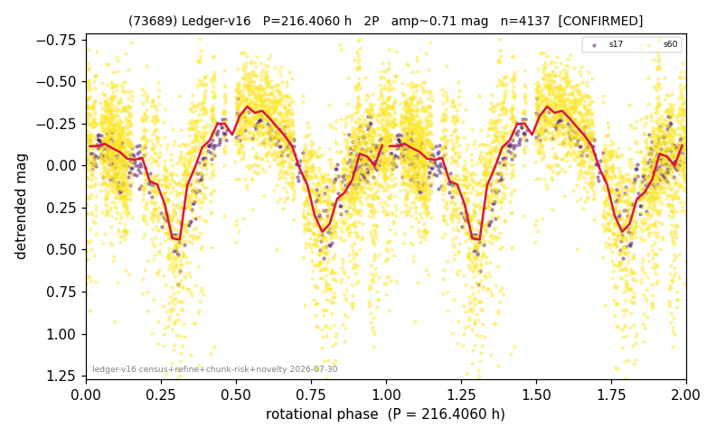

# (73689)

**Adopted:** 216.406 h, 2P, CONFIRMED

<!-- AUTO:START (regenerated from pipeline outputs; do not hand-edit this block) -->
## Evidence (auto)

Detected in 2 sector(s):

| sector | N | baseline (h) | P_phot (h) | power | FAP | cycles | flags |
|--|--|--|--|--|--|--|--|
| s17 | 429 | 449.5 | 109.1209 | 0.4377 | 8.9e-50 | 4.1 | 2P-ambiguous |
| s60 | 3721 | 279.6 | 107.2853 | 0.218 | 6.2e-194 | 2.6 | star-cleaned:18,phase-curve-risk,2P-unte |

- Pipeline refine said: **2P** (folded amp_fourier 0.608); flags: amp-from-clean-sectors(ignored s60);near-comb(amp-cleared):n=3;few-cycle:2.1;gap-alias-ris
- DIA (de-comb): not triggered (clean, fast, non-comb)
- Gates: FAP<1e-3 and power>=0.10 per detecting sector; >=2 sectors agree (harmonic-aware).
- Adopted shape: **2P** (folded-amplitude rule; pipeline agrees).

### Why this row reads the way it does

- 2 sector(s) detecting
- cross-sector fold correlation 0.93
- doubling MEASURED: odd-harmonic power at 216.41 h significant in BOTH sectors (8.96 and 7.73 sigma) -- the strongest doubling evidence in the programme, reproduced independently
- pipeline flag: few-cycle

<!-- AUTO:END -->
