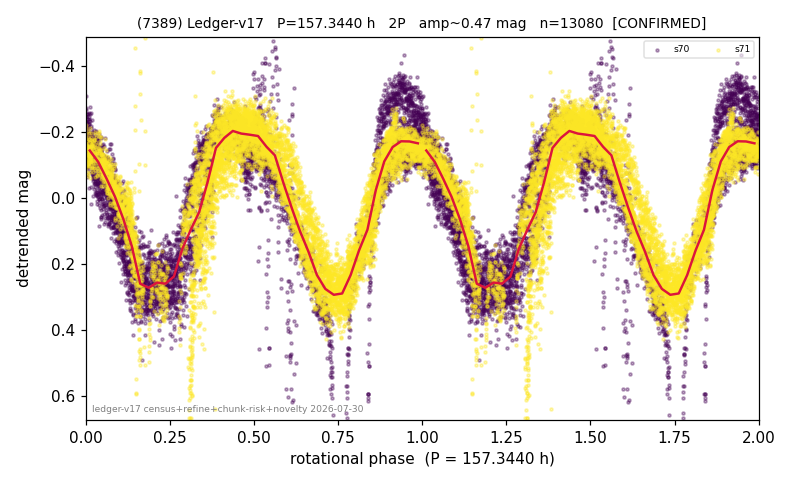

# (7389)

**Adopted:** 157.344 h, 2P, CONFIRMED

<!-- AUTO:START (regenerated from pipeline outputs; do not hand-edit this block) -->
## Evidence (auto)

Detected in 2 sector(s):

| sector | N | baseline (h) | P_phot (h) | power | FAP | cycles | flags |
|--|--|--|--|--|--|--|--|
| s70 | 5497 | 358.6 | 78.9819 | 0.73 | 0.0e+00 | 2.3 | star-cleaned:495 |
| s71 | 7679 | 608.3 | 78.3628 | 0.7903 | 0.0e+00 | 3.9 | star-cleaned:62 |

- Pipeline refine said: **2P** (folded amp_fourier 0.588); flags: few-cycle:3.9;gap-alias-risk:70h;sick-dips-excised:s70(44),s71(48)
- DIA (de-comb): not triggered (clean, fast, non-comb)
- Gates: FAP<1e-3 and power>=0.10 per detecting sector; >=2 sectors agree (harmonic-aware).
- Adopted shape: **2P** (folded-amplitude rule; pipeline agrees).

### Why this row reads the way it does

- 2 sector(s) detecting
- cross-sector fold correlation 0.92
- doubling BY CONVENTION: amplitude rule on folded amp 0.588 mag, not individually audited
- chunked sectors flagged (SUPPRESSED;direct-sector-supported) but a directly extracted sector carries the period
- pipeline flag: few-cycle

<!-- AUTO:END -->
