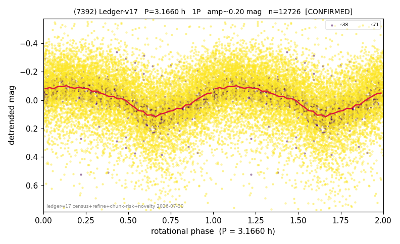

# (7392)

**Adopted:** 3.166 h, 1P, CONFIRMED

<!-- AUTO:START (regenerated from pipeline outputs; do not hand-edit this block) -->
## Evidence (auto)

Detected in 2 sector(s):

| sector | N | baseline (h) | P_phot (h) | power | FAP | cycles | flags |
|--|--|--|--|--|--|--|--|
| s38 | 2856 | 603.2 | 3.1655 | 0.4543 | 0.0e+00 | 190.5 | 2P-ambiguous |
| s71 | 9904 | 607.1 | 3.1662 | 0.1372 | 3.2e-312 | 191.7 | star-cleaned:198,2P-ambiguous |

- Pipeline refine said: **1P** (folded amp_fourier 0.203); flags: amp-from-clean-sectors(ignored s71);sick-dips-excised:s38(3),s71(17)
- DIA (de-comb): **NOT RUN for this lot.** No de-comb verdict exists for this object, so momentum-dump contamination has not been excluded by that test here.
- Gates: FAP<1e-3 and power>=0.10 per detecting sector; >=2 sectors agree (harmonic-aware).
- Adopted shape: **1P** (folded-amplitude rule; pipeline agrees).

### Why this row reads the way it does

- 2 sector(s) detecting
- cross-sector fold correlation 0.96
- single-peaked at folded amp 0.203 mag

<!-- AUTO:END -->
