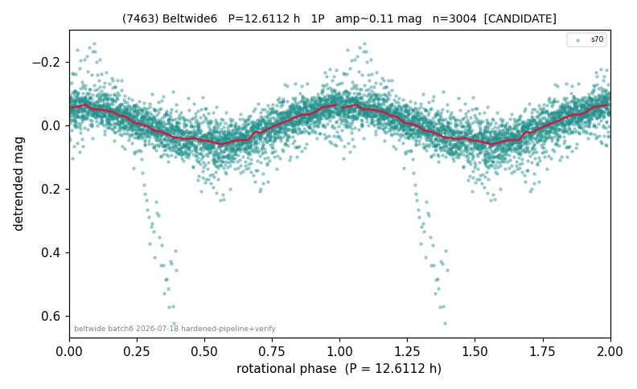

# (7463)

**Adopted:** 12.6112 h, 1P, CANDIDATE

<!-- AUTO:START (regenerated from pipeline outputs; do not hand-edit this block) -->
## Evidence (auto)

Detected in 1 sector(s):

| sector | N | baseline (h) | P_phot (h) | power | FAP | cycles | flags |
|--|--|--|--|--|--|--|--|
| s70 | 3004 | 225.2 | 12.6112 | 0.4881 | 0.0e+00 | 17.9 | 2P-ambiguous |

- Pipeline refine said: **1P** (folded amp_fourier 0.137); flags: clean
- DIA (de-comb): not triggered (clean, fast, non-comb)
- Gates: FAP<1e-3 and power>=0.10 per detecting sector; single strong sector (candidate ceiling).
- Adopted shape: **1P** (folded-amplitude rule; pipeline agrees).

### Why this row reads the way it does

- REVIEW-FLAG: folded_amp=0.114. Only sector s70 exists (sectors=1) so CONFIRMED is unreachable per house rule regardless of signal strength; LS on that sector gives P=12.6112h, power=0.488, FAP~0, 17.9 cycles over 225h baseline, and the binne

<!-- AUTO:END -->
