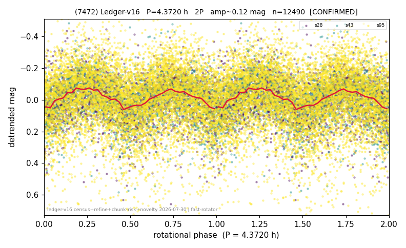

# (7472)

**Adopted:** 4.372 h, 2P, CONFIRMED

<!-- AUTO:START (regenerated from pipeline outputs; do not hand-edit this block) -->
## Evidence (auto)

Detected in 3 sector(s):

| sector | N | baseline (h) | P_phot (h) | power | FAP | cycles | flags |
|--|--|--|--|--|--|--|--|
| s28 | 2837 | 605.7 | 2.1855 | 0.1038 | 3.2e-63 | 277.1 | star-cleaned:6,2P-ambiguous |
| s43 | 2025 | 423.0 | 2.186 | 0.121 | 1.5e-52 | 193.5 | star-cleaned:14,2P-ambiguous |
| s95 | 7667 | 596.2 | 2.1871 | 0.0529 | 1.2e-85 | 272.6 | star-cleaned:108 |

- Pipeline refine said: **1P** (folded amp_fourier 0.139); flags: sick-dips-excised:s43(8);harmonic-only-agreement:s28(pw=0.08)
- DIA (de-comb): survived(dPW=-5%,R2=0.23,s43@2.186h,3sec)
- Coverage: **3 sector(s)**, best sector covers **138.53 cycles** of the adopted period. Measured periodogram peak width 0% of the period, i.e. about **+/- 0.003412 h** (1 sigma); the decimal places in the adopted value are not a precision claim.
- Factor of two: PHYSICS.
- Gates: FAP<1e-3 and power>=0.10 per detecting sector; >=2 sectors agree (harmonic-aware).
- **Adopted shape 2P OVERRIDES the pipeline's 1P** (doubling audit 2026-07-25: folded amplitude >= 0.25 mag, so a single-peaked curve is physically implausible; Harris convention -> 2P. The census 3-test doubling logic was measured at only 30% recall against 289 LCDB U>=2 ground-truth periods).

### Why this row reads the way it does

- 2 sector(s) detecting
- cross-sector fold correlation 0.90
- single-peaked at folded amp 0.139 mag
- pipeline flag: harmonic-only-agreement
- CORRECTED 2.186->4.3720 h (2026-08-01 sub-barrier sweep): all 49 catalog periods below 2.2 h sat on 5-16 km bodies, impossible as true rotations; doubling by SPIN-BARRIER PHYSICS: fold symmetric (photometry cannot decide), but a D~13 km body cannot rotate below the 2.2 h rubble-pile barrier, so the single-peaked reading is physically excluded
- 2P by spin-barrier physics (2026-08-01 sub-barrier sweep; D~13km body, base 2.186h sub-barrier)

<!-- AUTO:END -->
