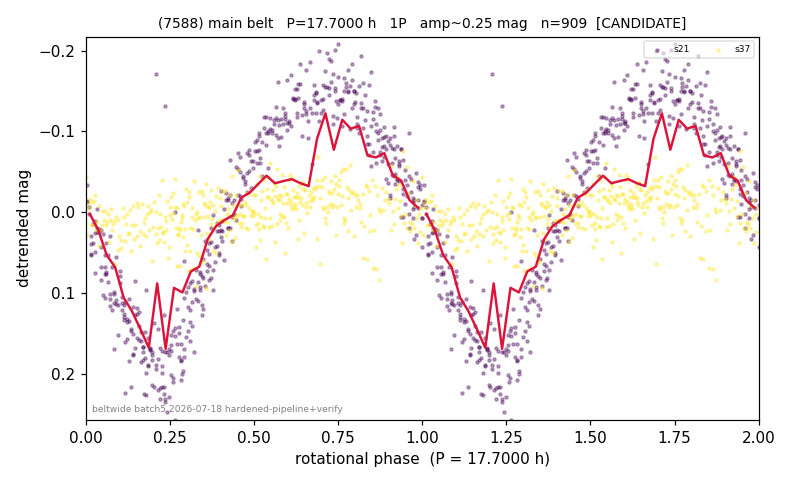

# (7588)

**Adopted:** 17.7 h, 1P, CANDIDATE

<!-- AUTO:START (regenerated from pipeline outputs; do not hand-edit this block) -->
## Evidence (auto)

Detected in 2 sector(s):

| sector | N | baseline (h) | P_phot (h) | power | FAP | cycles | flags |
|--|--|--|--|--|--|--|--|
| s21 | 503 | 298.5 | 17.7022 | 0.8697 | 2.8e-217 | 16.9 | 2P-ambiguous |
| s37 | 406 | 82.5 | 33.0037 | 0.2093 | 2.3e-17 | 2.5 | phase-curve-risk,2P-untestable |

- Refined shape: **1P** (folded amp_fourier 0.337); flags: incoherent-sectors:1/2;period-spread:60%;phase-curve-risk:1/2-sectors
- DIA (de-comb): not triggered (clean, fast, non-comb)
- Gates: FAP<1e-3 and power>=0.10 per detecting sector; single strong sector (candidate ceiling); folded-amplitude rule -> 1P.

<!-- AUTO:END -->
