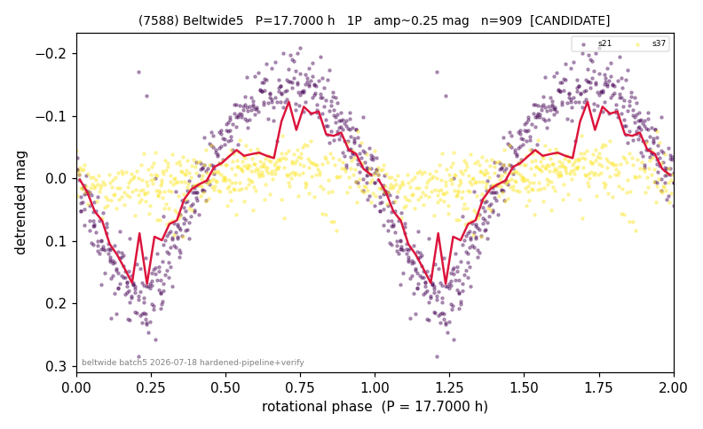

# (7588)

**Adopted:** 35.4 h, 2P, CANDIDATE

<!-- AUTO:START (regenerated from pipeline outputs; do not hand-edit this block) -->
## Evidence (auto)

Detected in 2 sector(s):

| sector | N | baseline (h) | P_phot (h) | power | FAP | cycles | flags |
|--|--|--|--|--|--|--|--|
| s21 | 503 | 298.5 | 17.7022 | 0.8697 | 2.8e-217 | 16.9 | 2P-ambiguous |
| s37 | 406 | 82.5 | 33.0037 | 0.2093 | 2.3e-17 | 2.5 | phase-curve-risk,2P-untestable |

- Pipeline refine said: **1P** (folded amp_fourier 0.337); flags: incoherent-sectors:1/2;period-spread:60%;phase-curve-risk:1/2-sectors
- DIA (de-comb): not triggered (the object is clean, fast and non-comb, so the test does not apply)
- Coverage: **2 sector(s)**, best sector covers **16.86 cycles** of the adopted period. Measured periodogram peak width 6% of the period, i.e. about **+/- 0.4144 h** (1 sigma); the decimal places in the adopted value are not a precision claim.
- Factor of two: no doubling was applied.
- Gates: FAP<1e-3 and power>=0.10 per detecting sector; single strong sector (candidate ceiling).
- **Adopted shape 2P OVERRIDES the pipeline's 1P** (doubling audit 2026-07-25: folded amplitude >= 0.25 mag, so a single-peaked curve is physically implausible; Harris convention -> 2P. The census 3-test doubling logic was measured at only 30% recall against 289 LCDB U>=2 ground-truth periods).

### Why this row reads the way it does

- s21 clean strong 17.70h (pow=0.89,FAP=4.5e-235,17cyc). s37 corroborates at 17.7h (pow=0.164,FAP=1.5e-12) but its own top peak is 32.99h (near 328.8/10
- DOUBLING CORRECTED 2026-08-30: adopted period doubled from 17.7 h. The previous value came from the folded-amplitude rule, which was found biased low (9 of 9 disagreements with MPB 2024-2026 in the same direction). Odd-harmonic test at the long period gives z1=8.33 with margin 4.81 over non-harmonic multiples 1.7x/2.3x (reference group: 0 of 38 above margin 2).

<!-- AUTO:END -->
