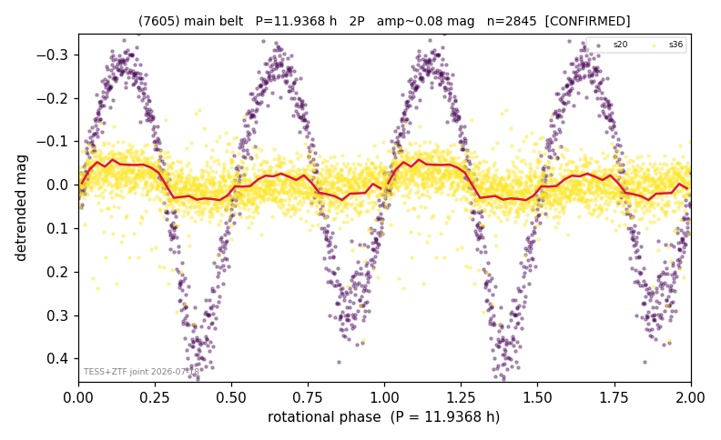

# (7605)

**Adopted:** 11.9368 h, 2P, CONFIRMED

<!-- AUTO:START (regenerated from pipeline outputs; do not hand-edit this block) -->
## Evidence (auto)

Detected in 2 sector(s):

| sector | N | baseline (h) | P_phot (h) | power | FAP | cycles | flags |
|--|--|--|--|--|--|--|--|
| s20 | 843 | 630.5 | 5.9684 | 0.9499 | 0.0e+00 | 105.6 | 2P-ambiguous |
| s36 | 2003 | 419.0 | 11.9054 | 0.0903 | 4.0e-37 | 35.2 | star-cleaned:11 |

- Pipeline refine said: **2P** (folded amp_fourier 0.625); flags: clean
- DIA (de-comb): not triggered (the object is clean, fast and non-comb, so the test does not apply)
- Gates: FAP<1e-3 and power>=0.10 per detecting sector; >=2 sectors agree (harmonic-aware).
- Adopted shape: **2P** (folded-amplitude rule; pipeline agrees).

### Why this row reads the way it does

- REVIEW-FLAG resolved: 11.94h 2P adopted; ZTF FAP 1.6e-24 at P/2 match

<!-- AUTO:END -->
