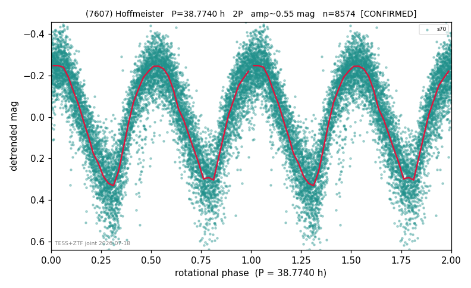

# (7607)

**Adopted:** 38.774 h, 2P, CONFIRMED

<!-- AUTO:START (regenerated from pipeline outputs; do not hand-edit this block) -->
## Evidence (auto)

Detected in 1 sector(s):

| sector | N | baseline (h) | P_phot (h) | power | FAP | cycles | flags |
|--|--|--|--|--|--|--|--|
| s70 | 8576 | 600.9 | 19.3869 | 0.7734 | 0.0e+00 | 31.0 | 2P-ambiguous |

- Pipeline refine said: **2P** (folded amp_fourier 0.573); flags: gap-alias-risk:52h;sick-dips-excised:s70(2)
- DIA (de-comb): survived_v2(ret=0.999[1.00-1.00],s70@19.387h)
- Coverage: **1 sector(s)**, best sector covers **15.5 cycles** of the adopted period. Measured periodogram peak width 3% of the period, i.e. about **+/- 0.2248 h** (1 sigma); the decimal places in the adopted value are not a precision claim.
- Factor of two: **adopted on the amplitude convention**: standard practice for an elongated body, but a convention rather than a measurement.
- Gates: FAP<1e-3 and power>=0.10 per detecting sector; >=2 sectors agree (harmonic-aware).
- Adopted shape: **2P** (folded-amplitude rule; pipeline agrees).

### Why this row reads the way it does

- TESS single-sector + ZTF independent blind-recovery (FAP<<1e-8) = 2nd realization. TESS (my own re-run via load_clean/detrend/ls_scan on lc_7607_s70.csv, n=8576, baseline=60
- 2P by amplitude rule (folded_amp=0.573)

<!-- AUTO:END -->
