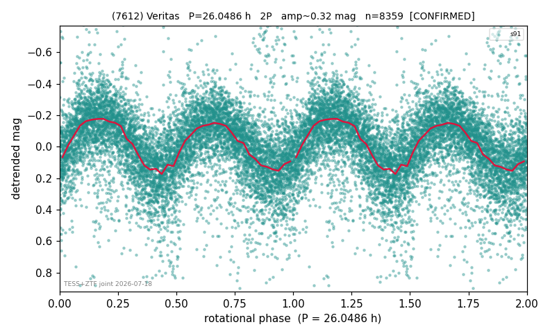

# (7612)

**Adopted:** 26.0486 h, 2P, CONFIRMED

<!-- AUTO:START (regenerated from pipeline outputs; do not hand-edit this block) -->
## Evidence (auto)

Detected in 1 sector(s):

| sector | N | baseline (h) | P_phot (h) | power | FAP | cycles | flags |
|--|--|--|--|--|--|--|--|
| s91 | 8502 | 635.0 | 13.0243 | 0.2409 | 0.0e+00 | 48.8 | star-cleaned:106,2P-ambiguous |

- Pipeline refine said: **1P** (folded amp_fourier 0.314); flags: sick-dips-excised:s91(85)
- DIA (de-comb): survived_v2(ret=1.000[1.00-1.00],s91@13.024h)
- Coverage: **1 sector(s)**, best sector covers **24.38 cycles** of the adopted period. Measured periodogram peak width 2% of the period, i.e. about **+/- 0.1104 h** (1 sigma); the decimal places in the adopted value are not a precision claim.
- Factor of two: **adopted on the amplitude convention**: standard practice for an elongated body, but a convention rather than a measurement.
- Gates: FAP<1e-3 and power>=0.10 per detecting sector; >=2 sectors agree (harmonic-aware).
- **Adopted shape 2P OVERRIDES the pipeline's 1P** (doubling audit 2026-07-25: folded amplitude >= 0.25 mag, so a single-peaked curve is physically implausible; Harris convention -> 2P. The census 3-test doubling logic was measured at only 30% recall against 289 LCDB U>=2 ground-truth periods).

### Why this row reads the way it does

- TESS single-sector + ZTF independent blind-recovery (FAP<<1e-8) = 2nd realization. TESS s91 (8502 pts, 26.46d baseline, 48.8 cycles) gives a razor-sharp error-weighted LS pe; P doubled 2026-07-25 (doubling audit: amp>=0.25 + Harris convention)

<!-- AUTO:END -->
