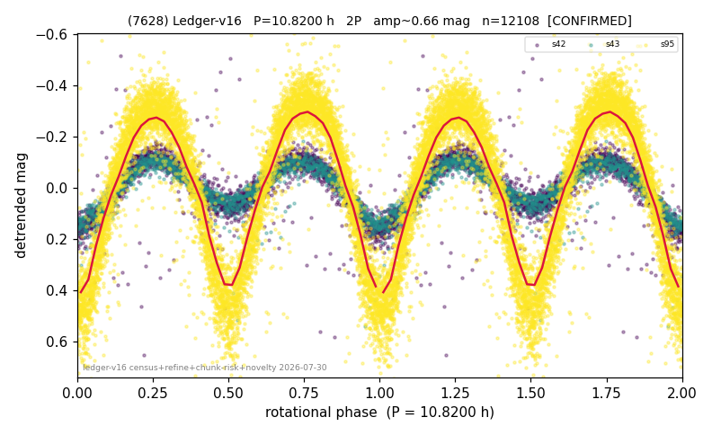

# (7628)

**Adopted:** 10.82 h, 2P, CONFIRMED

<!-- AUTO:START (regenerated from pipeline outputs; do not hand-edit this block) -->
## Evidence (auto)

Detected in 3 sector(s):

| sector | N | baseline (h) | P_phot (h) | power | FAP | cycles | flags |
|--|--|--|--|--|--|--|--|
| s42 | 2394 | 605.0 | 5.4108 | 0.635 | 0.0e+00 | 55.9 | star-cleaned:13 |
| s43 | 1552 | 401.3 | 5.4088 | 0.7109 | 0.0e+00 | 37.1 | star-cleaned:5 |
| s95 | 8221 | 599.5 | 5.4099 | 0.8586 | 0.0e+00 | 110.8 | star-cleaned:28,2P-ambiguous |

- Pipeline refine said: **2P** (folded amp_fourier 0.781); flags: sick-dips-excised:s42(1),s95(51)
- DIA (de-comb): survived(dPW=-0%,R2=0.00,s95@5.410h,6sec)
- Gates: FAP<1e-3 and power>=0.10 per detecting sector; >=2 sectors agree (harmonic-aware).
- Adopted shape: **2P** (folded-amplitude rule; pipeline agrees).

### Why this row reads the way it does

- 3 sector(s) detecting
- cross-sector fold correlation 0.97
- doubling BY CONVENTION: amplitude rule on folded amp 0.781 mag, not individually audited

<!-- AUTO:END -->
