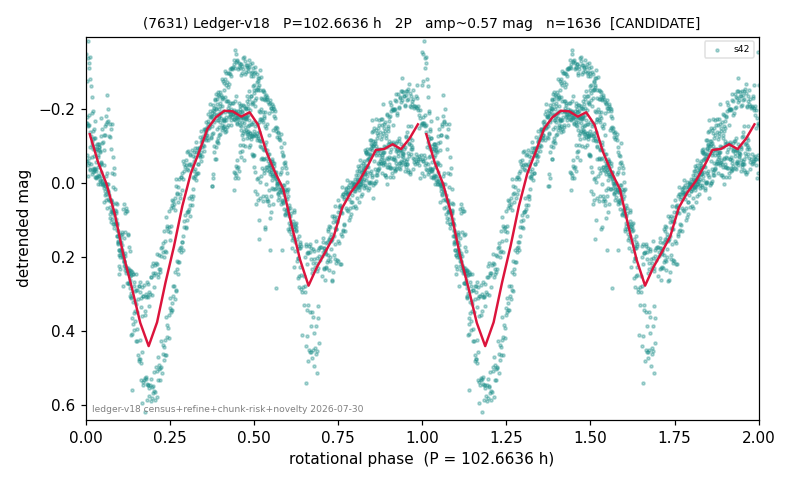

# (7631)

**Adopted:** 102.6636 h, 2P, CANDIDATE

<!-- AUTO:START (regenerated from pipeline outputs; do not hand-edit this block) -->
## Evidence (auto)

Detected in 1 sector(s):

| sector | N | baseline (h) | P_phot (h) | power | FAP | cycles | flags |
|--|--|--|--|--|--|--|--|
| s42 | 1639 | 512.0 | 51.3318 | 0.7217 | 0.0e+00 | 5.0 | star-cleaned:7 |

- Pipeline refine said: **2P** (folded amp_fourier 0.552); flags: gap-alias-risk:151h;sick-dips-excised:s42(2)
- DIA (de-comb): survived(dPW=+7%,R2=0.09,s42@51.332h,2sec)
- Gates: FAP<1e-3 and power>=0.10 per detecting sector; single strong sector (candidate ceiling).
- Adopted shape: **2P** (folded-amplitude rule; pipeline agrees).

### Why this row reads the way it does

- 1 sector(s) detecting
- doubling BY CONVENTION: amplitude rule on folded amp 0.552 mag, not individually audited

<!-- AUTO:END -->
