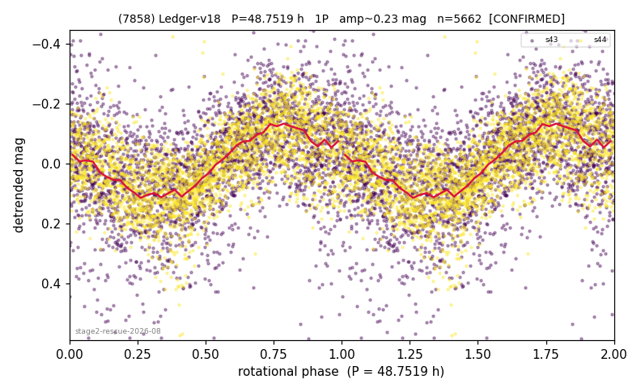

# (7858)

**Adopted:** 48.7519 h, 1P, CONFIRMED

<!-- AUTO:START (regenerated from pipeline outputs; do not hand-edit this block) -->
## Evidence (auto)

Detected in 2 sector(s):

| sector | N | baseline (h) | P_phot (h) | power | FAP | cycles | flags |
|--|--|--|--|--|--|--|--|
| s43 | 2974 | 593.1 | 48.2104 | 0.2615 | 4.9e-191 | 12.3 | star-cleaned:1,2P-ambiguous |
| s44 | 2723 | 580.9 | 48.7508 | 0.4107 | 9.2e-308 | 11.9 | star-cleaned:39,2P-ambiguous |

- Pipeline refine said: **1P** (folded amp_fourier 0.258); flags: dump-alias-suspect:n=7;gap-alias-risk:77h;sick-dips-excised:s43(1)
- DIA (de-comb): survived(dPW=+3%,R2=0.23,s43@48.210h,1sec)
- Coverage: **2 sector(s)**, best sector covers **12.16 cycles** of the adopted period. Measured periodogram peak width 7% of the period, i.e. about **+/- 1.402 h** (1 sigma); the decimal places in the adopted value are not a precision claim.
- Factor of two: no doubling was applied.
- Gates: FAP<1e-3 and power>=0.10 per detecting sector; >=2 sectors agree (harmonic-aware).
- Adopted shape: **1P** (folded-amplitude rule; pipeline agrees).

### Why this row reads the way it does

- stage-2 crowding-rescue harvest (|b| 5-15 deg, METHODOLOGY 5b-ter), verified 2026-08-10 by refutation-first waves: blind LS+PDM re-derivation, harmonic-aware comb test, field control where near-comb, shape rules per 3b, all vetoes checked
- clean 2-sector agreement s43+s44, FAP ~1e-300, PDM confirms within 8%, no comb, no vetoes; amp 0.24 below the rule -> 1P

<!-- AUTO:END -->
