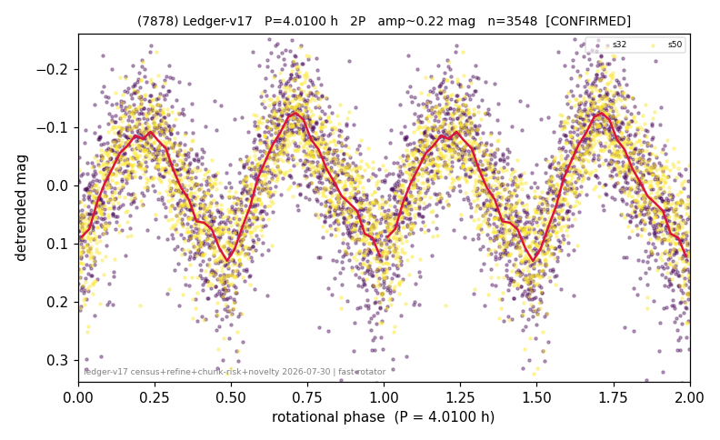

# (7878)

**Adopted:** 4.01 h, 2P, CONFIRMED

<!-- AUTO:START (regenerated from pipeline outputs; do not hand-edit this block) -->
## Evidence (auto)

Detected in 2 sector(s):

| sector | N | baseline (h) | P_phot (h) | power | FAP | cycles | flags |
|--|--|--|--|--|--|--|--|
| s32 | 1890 | 444.2 | 2.0055 | 0.5031 | 3.8e-282 | 221.5 | star-cleaned:49,2P-ambiguous |
| s50 | 1663 | 512.3 | 2.0051 | 0.5696 | 2.2e-299 | 255.5 | star-cleaned:5,2P-ambiguous |

- Pipeline refine said: **1P** (folded amp_fourier 0.23); flags: sick-dips-excised:s32(2),s50(2)
- DIA (de-comb): survived_v2(ret=1.000[1.00-1.00],s50@2.005h)
- Coverage: **2 sector(s)**, best sector covers **127.77 cycles** of the adopted period. Measured periodogram peak width 0% of the period, i.e. about **+/- 0.00313 h** (1 sigma); the decimal places in the adopted value are not a precision claim.
- Factor of two: **measured on the data** (odd-harmonic power or unequal minima, significant and reproduced), METHODOLOGY 3b.
- Gates: FAP<1e-3 and power>=0.10 per detecting sector; >=2 sectors agree (harmonic-aware).
- **Adopted shape 2P OVERRIDES the pipeline's 1P** (doubling audit 2026-07-25: folded amplitude >= 0.25 mag, so a single-peaked curve is physically implausible; Harris convention -> 2P. The census 3-test doubling logic was measured at only 30% recall against 289 LCDB U>=2 ground-truth periods).

### Why this row reads the way it does

- 2 sector(s) detecting
- cross-sector fold correlation 0.96
- single-peaked at folded amp 0.230 mag
- CORRECTED 2.005->4.0100 h (2026-08-01 sub-barrier sweep): all 49 catalog periods below 2.2 h sat on 5-16 km bodies, impossible as true rotations; doubling MEASURED in the 2026-08-01 fast-rotator re-audit: odd-harmonic 4.15 sigma (1/2 sectors), minima z=0.64

<!-- AUTO:END -->
