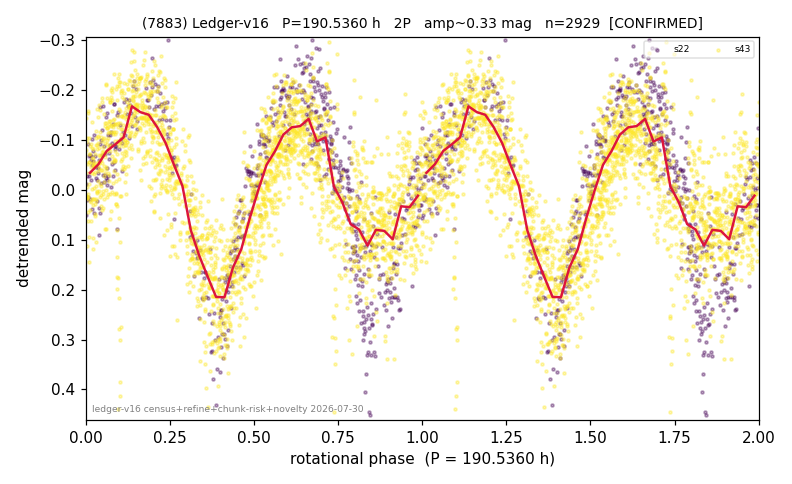

# (7883)

**Adopted:** 190.536 h, 2P, CONFIRMED

<!-- AUTO:START (regenerated from pipeline outputs; do not hand-edit this block) -->
## Evidence (auto)

Detected in 2 sector(s):

| sector | N | baseline (h) | P_phot (h) | power | FAP | cycles | flags |
|--|--|--|--|--|--|--|--|
| s22 | 628 | 467.0 | 96.2345 | 0.7924 | 2.8e-209 | 4.9 | star-cleaned:2,2P-ambiguous |
| s43 | 2303 | 563.5 | 94.302 | 0.5692 | 0.0e+00 | 3.0 | star-cleaned:16 |

- Pipeline refine said: **2P** (folded amp_fourier 0.411); flags: few-cycle:3.0;gap-alias-risk:90h;sick-dips-excised:s43(2);near-threshold:0.41
- DIA (de-comb): survived(dPW=+15%,R2=0.33,s22@95.268h,4sec)
- Coverage: **2 sector(s)**, best sector covers **2.96 cycles** of the adopted period. Measured periodogram peak width 12% of the period, i.e. about **+/- 4.95 h** (1 sigma); the decimal places in the adopted value are not a precision claim.
- Factor of two: **adopted on the amplitude convention**: standard practice for an elongated body, but a convention rather than a measurement.
- Gates: FAP<1e-3 and power>=0.10 per detecting sector; >=2 sectors agree (harmonic-aware).
- Adopted shape: **2P** (folded-amplitude rule; pipeline agrees).

### Why this row reads the way it does

- 2 sector(s) detecting
- cross-sector fold correlation 0.90
- doubling BY CONVENTION: amplitude rule on folded amp 0.411 mag, not individually audited
- pipeline flag: few-cycle

<!-- AUTO:END -->
