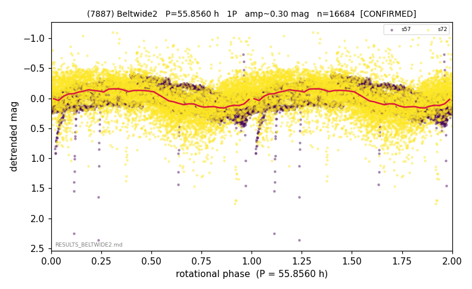

# (7887)

**Adopted:** 55.856 h, 1P, CONFIRMED

<!-- AUTO:START (regenerated from pipeline outputs; do not hand-edit this block) -->
## Evidence (auto)

Detected in 2 sector(s):

| sector | N | baseline (h) | P_phot (h) | power | FAP | cycles | flags |
|--|--|--|--|--|--|--|--|
| s57 | 8672 | 672.9 | 55.5224 | 0.4023 | 0.0e+00 | 6.1 | star-cleaned:33 |
| s72 | 8012 | 599.8 | 56.1905 | 0.2334 | 0.0e+00 | 5.3 | star-cleaned:220 |

- Refined shape: **1P** (folded amp_fourier 0.374); flags: near-comb(amp-cleared):n=6;sector-dropped:s57(range>3mag);sick-dips-excised:s72(19);near-t
- DIA (de-comb): survived(dPW=+1%,R2=0.01,s57@55.856h,5sec)
- Gates: FAP<1e-3 and power>=0.10 per detecting sector; >=2 sectors agree (harmonic-aware); folded-amplitude rule -> 1P.

<!-- AUTO:END -->
