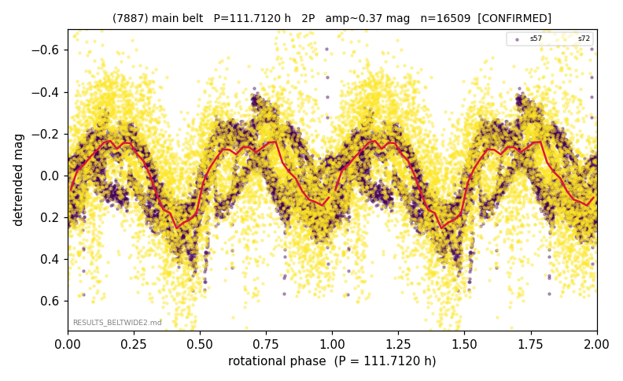

# (7887)

**Adopted:** 111.712 h, 2P, CONFIRMED

<!-- AUTO:START (regenerated from pipeline outputs; do not hand-edit this block) -->
## Evidence (auto)

Detected in 2 sector(s):

| sector | N | baseline (h) | P_phot (h) | power | FAP | cycles | flags |
|--|--|--|--|--|--|--|--|
| s57 | 8672 | 672.9 | 55.5224 | 0.4023 | 0.0e+00 | 6.1 | star-cleaned:33 |
| s72 | 8012 | 599.8 | 56.1905 | 0.2334 | 0.0e+00 | 5.3 | star-cleaned:220 |

- Pipeline refine said: **1P** (folded amp_fourier 0.391); flags: near-comb(amp-cleared):n=6;gap-alias-risk:75h;sick-dips-excised:s57(6),s72(19);near-thresh
- DIA (de-comb): survived(dPW=+1%,R2=0.01,s57@55.856h,5sec)
- Coverage: **3 sector(s)**, best sector covers **6.02 cycles** of the adopted period. Measured periodogram peak width 7% of the period, i.e. about **+/- 1.657 h** (1 sigma); the decimal places in the adopted value are not a precision claim.
- Factor of two: **adopted on the amplitude convention**: standard practice for an elongated body, but a convention rather than a measurement.
- Gates: FAP<1e-3 and power>=0.10 per detecting sector; >=2 sectors agree (harmonic-aware).
- **Adopted shape 2P OVERRIDES the pipeline's 1P** (doubling audit 2026-07-25: folded amplitude >= 0.25 mag, so a single-peaked curve is physically implausible; Harris convention -> 2P. The census 3-test doubling logic was measured at only 30% recall against 289 LCDB U>=2 ground-truth periods).

### Why this row reads the way it does

- VIRGIN first det; NOT comb 54.8h (resolved on 432-day baseline, both sectors above comb same direction); amp 0.39 near-threshold; P doubled 2026-07-25 (doubling audit: amp>=0.25 + Harris convention)
- NPA (tumbling) CANDIDATE 2026-08-02: second non-harmonic frequency 87.2/86.7 h reproduced <1% across sectors, de-comb survived, harmonic veto passed; rotation period unchanged; see docs NPA dossier
- s39 crowding-rescued (2026-08-08, |b| 5-15 deg rescue, 5-point crowding penalty, 72 vs 77 per cent LCDB agreement): power 0.45, FAP 9.5e-290 at the adopted photometric period, 5.8 cycles, chunk-extracted

<!-- AUTO:END -->

## Tumbling (NPA) candidate (2026-08-02)

Beyond the catalog rotation of 111.712 h, a second, non-harmonic frequency is present:
87.236 h in s57 and 86.670 h in s72 (agreement 0.7%). Both sectors pass the
common-fundamental veto, the combination terms carry significant power (Fcomb 209 / 60),
and the signal survives the eigen-systematics de-comb with a 1-5% power change (its
proximity to the 328.8/3 h comb line is coincidental). Evidence chart and method:
[TUMBLERS.md](../TUMBLERS.md). The rotation period above is unaffected.
