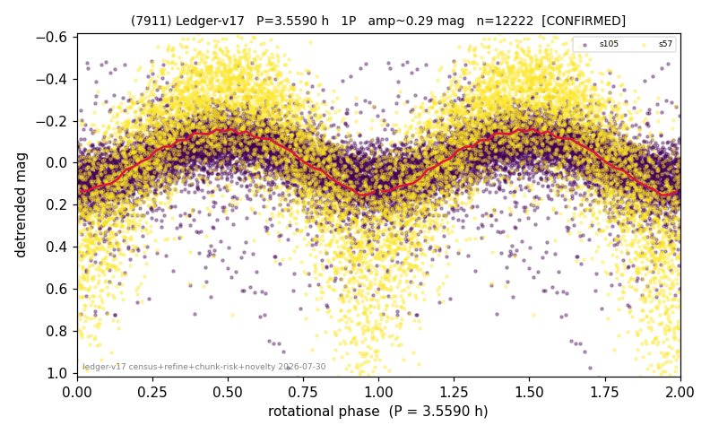

# (7911)

**Adopted:** 3.559 h, 1P, CONFIRMED

<!-- AUTO:START (regenerated from pipeline outputs; do not hand-edit this block) -->
## Evidence (auto)

Detected in 2 sector(s):

| sector | N | baseline (h) | P_phot (h) | power | FAP | cycles | flags |
|--|--|--|--|--|--|--|--|
| s57 | 4805 | 398.3 | 3.5591 | 0.502 | 0.0e+00 | 111.9 | 2P-ambiguous |
| s105 | 7460 | 620.9 | 3.5597 | 0.3656 | 0.0e+00 | 174.4 | star-cleaned:70,2P-ambiguous |

- Pipeline refine said: **1P** (folded amp_fourier 0.238); flags: amp-from-clean-sectors(ignored s57);sick-dips-excised:s105(37),s57(5)
- DIA (de-comb): survived_v2(ret=1.000[1.00-1.00],s57@3.559h)
- Coverage: **2 sector(s)**, best sector covers **174.46 cycles** of the adopted period. Measured periodogram peak width 1% of the period, i.e. about **+/- 0.007936 h** (1 sigma); the decimal places in the adopted value are not a precision claim.
- Factor of two: no doubling was applied.
- Gates: FAP<1e-3 and power>=0.10 per detecting sector; >=2 sectors agree (harmonic-aware).
- Adopted shape: **1P** (folded-amplitude rule; pipeline agrees).

### Why this row reads the way it does

- 2 sector(s) detecting
- cross-sector fold correlation 0.96
- single-peaked at folded amp 0.238 mag

<!-- AUTO:END -->
