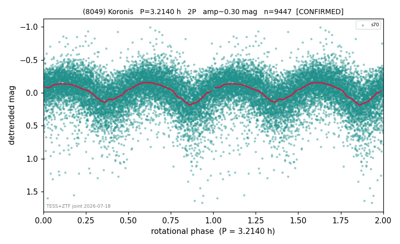

# (8049)

**Adopted:** 3.214 h, 2P, CONFIRMED

<!-- AUTO:START (regenerated from pipeline outputs; do not hand-edit this block) -->
## Evidence (auto)

Detected in 1 sector(s):

| sector | N | baseline (h) | P_phot (h) | power | FAP | cycles | flags |
|--|--|--|--|--|--|--|--|
| s70 | 9447 | 599.4 | 1.6069 | 0.1879 | 0.0e+00 | 373.0 | star-cleaned:43,2P-ambiguous |

- Pipeline refine said: **1P** (folded amp_fourier 0.323); flags: sick-dips-excised:s70(22)
- DIA (de-comb): survived(dPW=-0%,R2=0.02,s70@1.607h,2sec)
- Coverage: **1 sector(s)**, best sector covers **186.5 cycles** of the adopted period. Measured periodogram peak width 0% of the period, i.e. about **+/- 0.00215 h** (1 sigma); the decimal places in the adopted value are not a precision claim.
- Factor of two: PHYSICS.
- Gates: FAP<1e-3 and power>=0.10 per detecting sector; >=2 sectors agree (harmonic-aware).
- **Adopted shape 2P OVERRIDES the pipeline's 1P** (doubling audit 2026-07-25: folded amplitude >= 0.25 mag, so a single-peaked curve is physically implausible; Harris convention -> 2P. The census 3-test doubling logic was measured at only 30% recall against 289 LCDB U>=2 ground-truth periods).

### Why this row reads the way it does

- TESS single-sector + ZTF independent blind-recovery (FAP<<1e-8) = 2nd realization. TESS sector 70 alone gives a clean, non-comb, non-grid-edge detection at P_phot=1.607h (po
- 2P by spin-barrier physics (base 1.606h sub-barrier); ZTF blind-recovery of base period corroborates (FAP 1.0e-104), folded amp 0.84 also above threshold

<!-- AUTO:END -->
