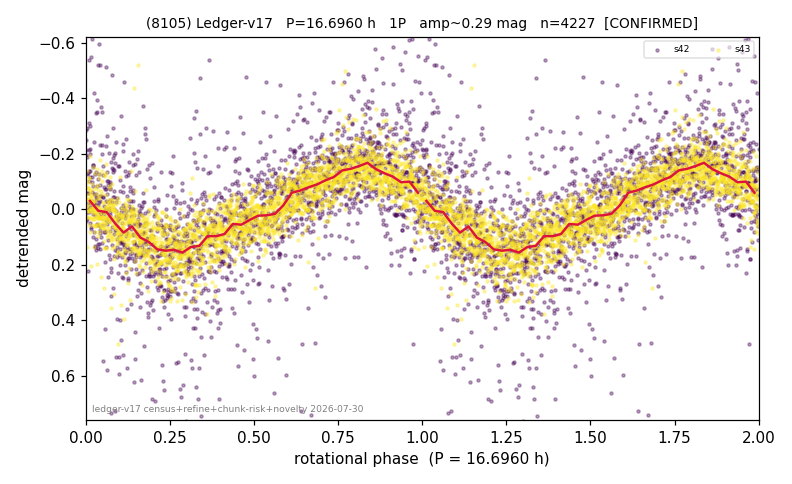

# (8105)

**Adopted:** 16.696 h, 1P, CONFIRMED

<!-- AUTO:START (regenerated from pipeline outputs; do not hand-edit this block) -->
## Evidence (auto)

Detected in 2 sector(s):

| sector | N | baseline (h) | P_phot (h) | power | FAP | cycles | flags |
|--|--|--|--|--|--|--|--|
| s42 | 1924 | 557.4 | 16.708 | 0.2938 | 7.7e-141 | 33.4 | star-cleaned:31,2P-ambiguous |
| s43 | 2343 | 565.0 | 16.6836 | 0.6808 | 0.0e+00 | 33.9 | star-cleaned:24,2P-ambiguous |

- Pipeline refine said: **1P** (folded amp_fourier 0.364); flags: sick-dips-excised:s42(15);near-threshold:0.36
- DIA (de-comb): survived(dPW=+3%,R2=0.04,s43@16.696h,2sec)
- Gates: FAP<1e-3 and power>=0.10 per detecting sector; >=2 sectors agree (harmonic-aware).
- Adopted shape: **1P** (folded-amplitude rule; pipeline agrees).

### Why this row reads the way it does

- 2 sector(s) detecting
- cross-sector fold correlation 0.95
- single-peaked at folded amp 0.364 mag

<!-- AUTO:END -->
