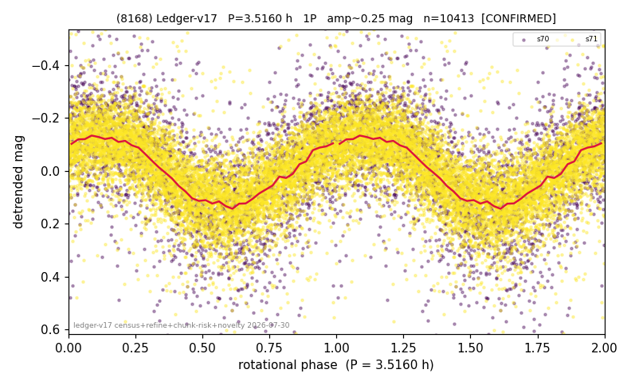

# (8168)

**Adopted:** 3.516 h, 1P, CONFIRMED

<!-- AUTO:START (regenerated from pipeline outputs; do not hand-edit this block) -->
## Evidence (auto)

Detected in 2 sector(s):

| sector | N | baseline (h) | P_phot (h) | power | FAP | cycles | flags |
|--|--|--|--|--|--|--|--|
| s70 | 2684 | 361.1 | 3.5157 | 0.3189 | 4.9e-219 | 102.7 | star-cleaned:6,2P-ambiguous |
| s71 | 7750 | 595.4 | 3.5167 | 0.4762 | 0.0e+00 | 169.3 | star-cleaned:81,2P-ambiguous |

- Pipeline refine said: **1P** (folded amp_fourier 0.34); flags: sick-dips-excised:s70(7),s71(14)
- DIA (de-comb): **NOT RUN for this lot.** No de-comb verdict exists for this object, so momentum-dump contamination has not been excluded by that test here.
- Gates: FAP<1e-3 and power>=0.10 per detecting sector; >=2 sectors agree (harmonic-aware).
- Adopted shape: **1P** (folded-amplitude rule; pipeline agrees).

### Why this row reads the way it does

- 2 sector(s) detecting
- cross-sector fold correlation 0.96
- single-peaked at folded amp 0.340 mag

<!-- AUTO:END -->
