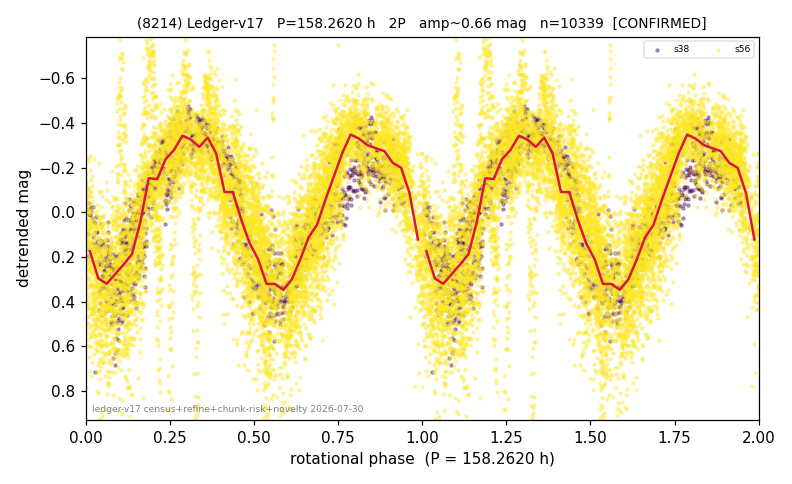

# (8214)

**Adopted:** 158.262 h, 2P, CONFIRMED

<!-- AUTO:START (regenerated from pipeline outputs; do not hand-edit this block) -->
## Evidence (auto)

Detected in 2 sector(s):

| sector | N | baseline (h) | P_phot (h) | power | FAP | cycles | flags |
|--|--|--|--|--|--|--|--|
| s38 | 1560 | 348.3 | 79.1102 | 0.8023 | 0.0e+00 | 4.4 | 2P-ambiguous |
| s56 | 8851 | 651.4 | 79.2485 | 0.5319 | 0.0e+00 | 8.2 | 2P-ambiguous |

- Pipeline refine said: **2P** (folded amp_fourier 0.693); flags: amp-from-clean-sectors(ignored s56);sick-dips-excised:s56(81)
- DIA (de-comb): survived_v2(ret=0.958[0.74-0.99],s38@79.131h)
- Coverage: **2 sector(s)**, best sector covers **4.12 cycles** of the adopted period. Measured periodogram peak width 10% of the period, i.e. about **+/- 3.423 h** (1 sigma); the decimal places in the adopted value are not a precision claim.
- Factor of two: **adopted on the amplitude convention**: standard practice for an elongated body, but a convention rather than a measurement.
- Gates: FAP<1e-3 and power>=0.10 per detecting sector; >=2 sectors agree (harmonic-aware).
- Adopted shape: **2P** (folded-amplitude rule; pipeline agrees).

### Why this row reads the way it does

- 2 sector(s) detecting
- cross-sector fold correlation 0.93
- doubling BY CONVENTION: amplitude rule on folded amp 0.693 mag, not individually audited
- chunked sectors flagged (SUPPRESSED;direct-sector-supported) but a directly extracted sector carries the period
- chunk-extracted sectors re-extracted DIRECTLY 2026-08-06: power at the adopted period retained (s38 0.793->0.792, s56 0.481->0.456); the direct curves are now the published ones, so this period no longer rests on chunked photometry

<!-- AUTO:END -->
