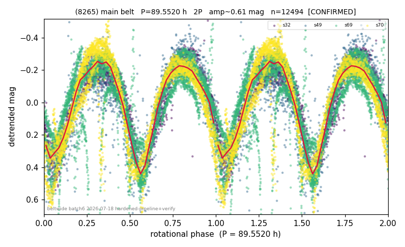

# (8265)

**Adopted:** 89.552 h, 2P, CONFIRMED

<!-- AUTO:START (regenerated from pipeline outputs; do not hand-edit this block) -->
## Evidence (auto)

Detected in 4 sector(s):

| sector | N | baseline (h) | P_phot (h) | power | FAP | cycles | flags |
|--|--|--|--|--|--|--|--|
| s32 | 1291 | 344.5 | 44.6075 | 0.7974 | 0.0e+00 | 7.7 | star-cleaned:27,2P-ambiguous |
| s49 | 1461 | 382.3 | 44.9443 | 0.5922 | 9.5e-280 | 8.5 | star-cleaned:10,2P-ambiguous |
| s69 | 6245 | 469.0 | 44.5438 | 0.6993 | 0.0e+00 | 10.5 | 2P-ambiguous |
| s70 | 3558 | 209.3 | 45.4076 | 0.8268 | 0.0e+00 | 4.6 | 2P-ambiguous |

- Refined shape: **2P** (folded amp_fourier 0.662); flags: few-cycle:3.8;sector-dropped:s49,s69(range>3mag);sick-dips-excised:s32(2),s70(1)
- DIA (de-comb): survived(dPW=+4%,R2=0.08,s32@44.776h,8sec)
- Gates: FAP<1e-3 and power>=0.10 per detecting sector; >=2 sectors agree (harmonic-aware); folded-amplitude rule -> 2P.

<!-- AUTO:END -->
