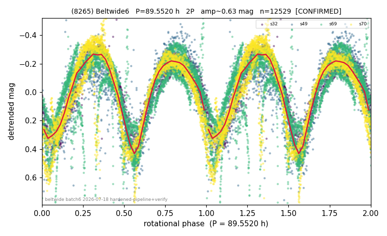

# (8265)

**Adopted:** 89.552 h, 2P, CONFIRMED

<!-- AUTO:START (regenerated from pipeline outputs; do not hand-edit this block) -->
## Evidence (auto)

Detected in 4 sector(s):

| sector | N | baseline (h) | P_phot (h) | power | FAP | cycles | flags |
|--|--|--|--|--|--|--|--|
| s32 | 1291 | 344.5 | 44.6075 | 0.7974 | 0.0e+00 | 7.7 | star-cleaned:27,2P-ambiguous |
| s49 | 1461 | 382.3 | 44.9443 | 0.5922 | 9.5e-280 | 8.5 | star-cleaned:10,2P-ambiguous |
| s69 | 6245 | 469.0 | 44.5438 | 0.6993 | 0.0e+00 | 10.5 | 2P-ambiguous |
| s70 | 3558 | 209.3 | 45.4076 | 0.8268 | 0.0e+00 | 4.6 | 2P-ambiguous |

- Pipeline refine said: **2P** (folded amp_fourier 0.662); flags: gap-alias-risk:65h;sick-dips-excised:s32(2),s49(13),s69(10),s70(1)
- DIA (de-comb): survived_v2(ret=0.965[0.95-0.98],s32@44.776h)
- Coverage: **4 sector(s)**, best sector covers **5.24 cycles** of the adopted period. Measured periodogram peak width 8% of the period, i.e. about **+/- 1.548 h** (1 sigma); the decimal places in the adopted value are not a precision claim.
- Factor of two: **adopted on the amplitude convention**: standard practice for an elongated body, but a convention rather than a measurement.
- Gates: FAP<1e-3 and power>=0.10 per detecting sector; >=2 sectors agree (harmonic-aware).
- Adopted shape: **2P** (folded-amplitude rule; pipeline agrees).

### Why this row reads the way it does

- REVIEW-FLAG: folded_amp=0.67. 4/4 sectors independently find the SAME fundamental P~44.5-45.4h (spread 1.9%, FAP~0; agreement holds even restricted to the 2 uncontaminated sectors s32/s70), and folded amplitude at that fundamental is 0.59-0

<!-- AUTO:END -->
