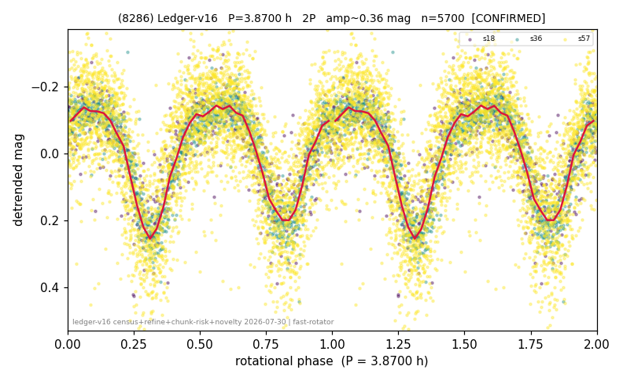

# (8286)

**Adopted:** 3.87 h, 2P, CONFIRMED

<!-- AUTO:START (regenerated from pipeline outputs; do not hand-edit this block) -->
## Evidence (auto)

Detected in 3 sector(s):

| sector | N | baseline (h) | P_phot (h) | power | FAP | cycles | flags |
|--|--|--|--|--|--|--|--|
| s18 | 529 | 445.5 | 1.9351 | 0.6358 | 1.3e-111 | 230.2 | 2P-ambiguous |
| s36 | 1335 | 271.0 | 1.9344 | 0.8147 | 0.0e+00 | 140.1 | 2P-ambiguous |
| s57 | 3855 | 352.3 | 1.9352 | 0.463 | 0.0e+00 | 182.0 | 2P-ambiguous |

- Pipeline refine said: **1P** (folded amp_fourier 0.355); flags: amp-from-clean-sectors(ignored s57);sick-dips-excised:s57(4);near-threshold:0.35
- DIA (de-comb): survived(dPW=+1%,R2=0.12,s36@1.935h,5sec)
- Coverage: **3 sector(s)**, best sector covers **115.11 cycles** of the adopted period. Measured periodogram peak width 0% of the period, i.e. about **+/- 0.003452 h** (1 sigma); the decimal places in the adopted value are not a precision claim.
- Factor of two: **measured on the data** (odd-harmonic power or unequal minima, significant and reproduced), METHODOLOGY 3b.
- Gates: FAP<1e-3 and power>=0.10 per detecting sector; >=2 sectors agree (harmonic-aware).
- **Adopted shape 2P OVERRIDES the pipeline's 1P** (doubling audit 2026-07-25: folded amplitude >= 0.25 mag, so a single-peaked curve is physically implausible; Harris convention -> 2P. The census 3-test doubling logic was measured at only 30% recall against 289 LCDB U>=2 ground-truth periods).

### Why this row reads the way it does

- 3 sector(s) detecting
- cross-sector fold correlation 0.97
- single-peaked at folded amp 0.355 mag
- CORRECTED 1.935->3.8700 h (2026-08-01 sub-barrier sweep): all 49 catalog periods below 2.2 h sat on 5-16 km bodies, impossible as true rotations; doubling MEASURED in the 2026-08-01 fast-rotator re-audit: odd-harmonic 3.50 sigma (2/3 sectors), minima z=4.76

<!-- AUTO:END -->
