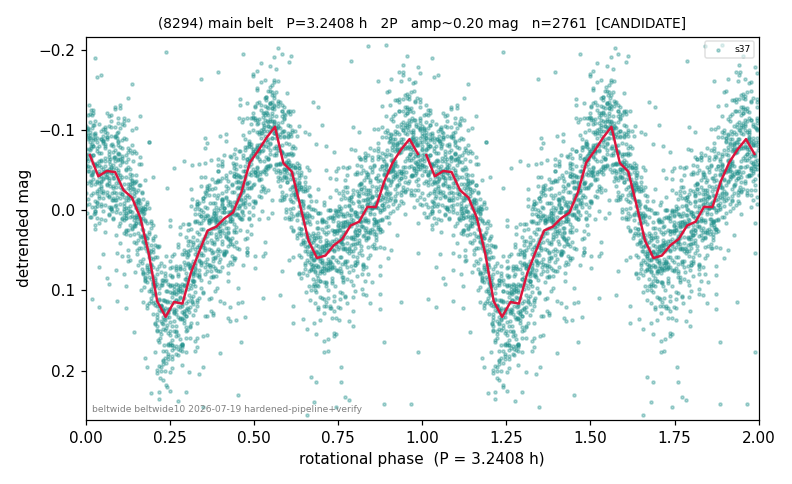

# (8294)

**Adopted:** 3.2408 h, 2P, CANDIDATE

<!-- AUTO:START (regenerated from pipeline outputs; do not hand-edit this block) -->
## Evidence (auto)

Detected in 1 sector(s):

| sector | N | baseline (h) | P_phot (h) | power | FAP | cycles | flags |
|--|--|--|--|--|--|--|--|
| s37 | 2771 | 591.8 | 1.6202 | 0.4639 | 0.0e+00 | 182.6 | clean |

- Refined shape: **1P** (folded amp_fourier 0.194); flags: sick-dips-excised:s37(1)
- DIA (de-comb): survived(dPW=+2%,R2=0.54,s37@1.620h,3sec)
- Gates: FAP<1e-3 and power>=0.10 per detecting sector; single strong sector (candidate ceiling); folded-amplitude rule -> 2P.

<!-- AUTO:END -->
