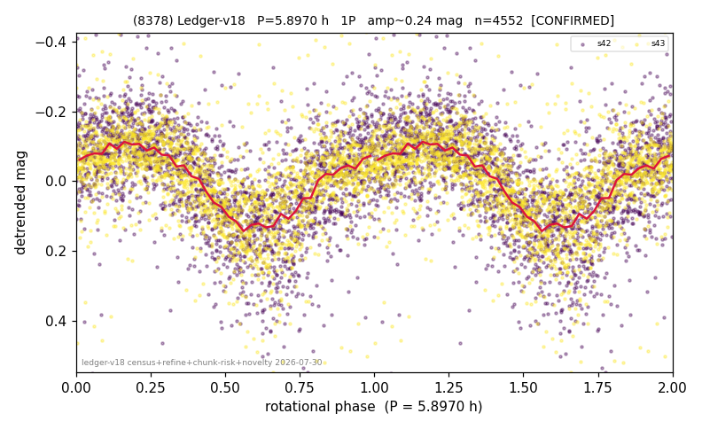

# (8378)

**Adopted:** 11.794 h, 2P, CONFIRMED

<!-- AUTO:START (regenerated from pipeline outputs; do not hand-edit this block) -->
## Evidence (auto)

Detected in 2 sector(s):

| sector | N | baseline (h) | P_phot (h) | power | FAP | cycles | flags |
|--|--|--|--|--|--|--|--|
| s42 | 2316 | 593.9 | 5.8947 | 0.3897 | 1.5e-243 | 50.4 | clean |
| s43 | 2241 | 573.7 | 5.8992 | 0.2978 | 2.1e-167 | 48.6 | clean |

- Pipeline refine said: **1P** (folded amp_fourier 0.308); flags: sick-dips-excised:s42(2)
- DIA (de-comb): survived(dPW=+7%,R2=0.49,s42@5.897h,4sec)
- Coverage: **2 sector(s)**, best sector covers **50.35 cycles** of the adopted period. Measured periodogram peak width 1% of the period, i.e. about **+/- 0.02104 h** (1 sigma); the decimal places in the adopted value are not a precision claim.
- Factor of two: **measured on the data** (odd-harmonic power or unequal minima, significant and reproduced), METHODOLOGY 3b.
- Gates: FAP<1e-3 and power>=0.10 per detecting sector; >=2 sectors agree (harmonic-aware).
- **Adopted shape 2P OVERRIDES the pipeline's 1P** (doubling audit 2026-07-25: folded amplitude >= 0.25 mag, so a single-peaked curve is physically implausible; Harris convention -> 2P. The census 3-test doubling logic was measured at only 30% recall against 289 LCDB U>=2 ground-truth periods).

### Why this row reads the way it does

- 2 sector(s) detecting
- cross-sector fold correlation 0.95
- single-peaked at folded amp 0.308 mag
- CORRECTED 5.897->11.7940 h (2026-08-02 full 1P re-audit): doubling MEASURED at odd-harmonic 11.6 sigma with ALL detecting sectors significant (2/2); threshold odd>=8+full-reproduction calibrated to 0/60 false fires on the 4P null test (the minima-asymmetry branch alone fired falsely at z up to 34 and is not accepted)

<!-- AUTO:END -->
