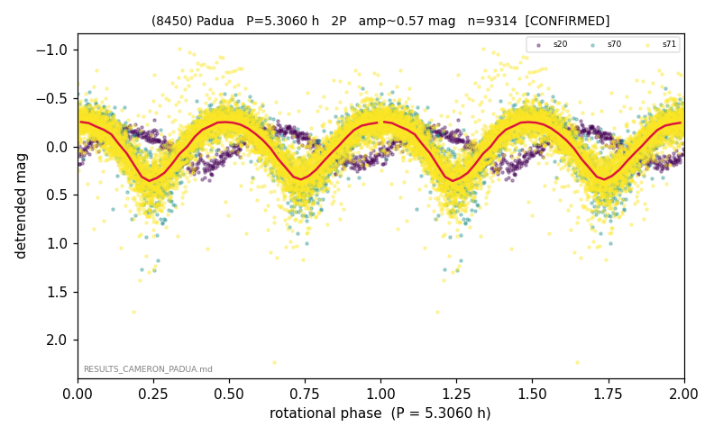

# (8450)

**Adopted:** 5.306 h, 2P, CONFIRMED

<!-- AUTO:START (regenerated from pipeline outputs; do not hand-edit this block) -->
## Evidence (auto)

Detected in 3 sector(s):

| sector | N | baseline (h) | P_phot (h) | power | FAP | cycles | flags |
|--|--|--|--|--|--|--|--|
| s20 | 634 | 519.5 | 2.6535 | 0.8491 | 5.8e-255 | 195.8 | 2P-ambiguous |
| s70 | 2074 | 115.2 | 2.653 | 0.7305 | 0.0e+00 | 43.4 | 2P-ambiguous |
| s71 | 6606 | 606.0 | 2.6532 | 0.6474 | 0.0e+00 | 228.4 | star-cleaned:20,2P-ambiguous |

- Refined shape: **2P** (folded amp_fourier 0.688); flags: sector-dropped:s71(range>3mag);sick-dips-excised:s70(3)
- DIA (de-comb): survived(dPW=+4%,R2=0.23,s20@2.653h,5sec)
- Gates: FAP<1e-3 and power>=0.10 per detecting sector; >=2 sectors agree (harmonic-aware); folded-amplitude rule -> 2P.

<!-- AUTO:END -->
