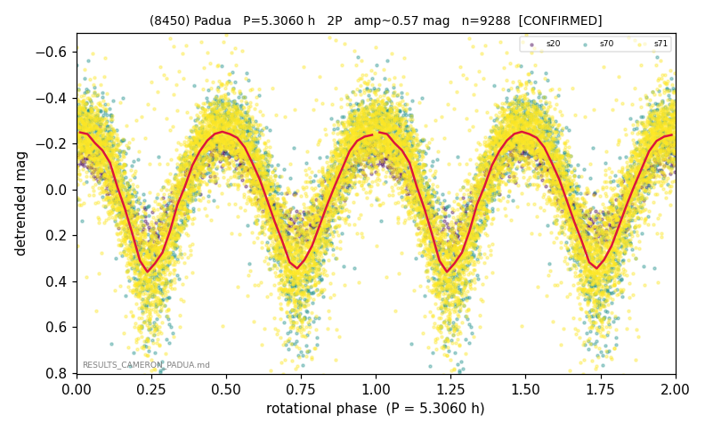

# (8450)

**Adopted:** 5.306 h, 2P, CONFIRMED

<!-- AUTO:START (regenerated from pipeline outputs; do not hand-edit this block) -->
## Evidence (auto)

Detected in 3 sector(s):

| sector | N | baseline (h) | P_phot (h) | power | FAP | cycles | flags |
|--|--|--|--|--|--|--|--|
| s20 | 634 | 519.5 | 2.6535 | 0.8491 | 5.8e-255 | 195.8 | 2P-ambiguous |
| s70 | 2074 | 115.2 | 2.653 | 0.7305 | 0.0e+00 | 43.4 | 2P-ambiguous |
| s71 | 6606 | 606.0 | 2.6532 | 0.6474 | 0.0e+00 | 228.4 | star-cleaned:20,2P-ambiguous |

- Pipeline refine said: **2P** (folded amp_fourier 0.688); flags: sick-dips-excised:s70(3),s71(23)
- DIA (de-comb): survived_v2(ret=1.000[1.00-1.00],s20@2.653h)
- Coverage: **3 sector(s)**, best sector covers **114.2 cycles** of the adopted period. Measured periodogram peak width 0% of the period, i.e. about **+/- 0.004141 h** (1 sigma); the decimal places in the adopted value are not a precision claim.
- Factor of two: **adopted on the amplitude convention**: standard practice for an elongated body, but a convention rather than a measurement.
- Gates: FAP<1e-3 and power>=0.10 per detecting sector; >=2 sectors agree (harmonic-aware).
- Adopted shape: **2P** (folded-amplitude rule; pipeline agrees).

### Why this row reads the way it does

- 3 sectors; base 2.653h; amp 0.69>0.40 doubling
- 2P by amplitude rule (folded_amp=0.688)

<!-- AUTO:END -->
