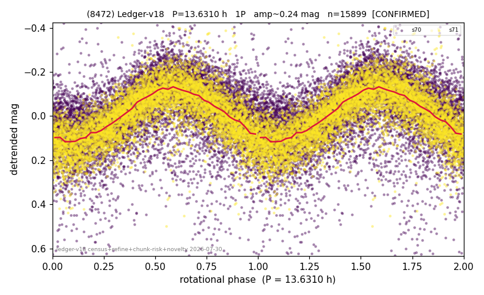

# (8472)

**Adopted:** 13.631 h, 1P, CONFIRMED

<!-- AUTO:START (regenerated from pipeline outputs; do not hand-edit this block) -->
## Evidence (auto)

Detected in 2 sector(s):

| sector | N | baseline (h) | P_phot (h) | power | FAP | cycles | flags |
|--|--|--|--|--|--|--|--|
| s70 | 8981 | 587.3 | 13.6331 | 0.2817 | 0.0e+00 | 43.1 | star-cleaned:118,2P-ambiguous |
| s71 | 6990 | 507.6 | 13.6283 | 0.5719 | 0.0e+00 | 37.2 | star-cleaned:105,2P-ambiguous |

- Pipeline refine said: **1P** (folded amp_fourier 0.257); flags: sick-dips-excised:s70(36),s71(6)
- DIA (de-comb): survived(dPW=-2%,R2=0.03,s71@13.631h,3sec)
- Gates: FAP<1e-3 and power>=0.10 per detecting sector; >=2 sectors agree (harmonic-aware).
- Adopted shape: **1P** (folded-amplitude rule; pipeline agrees).

### Why this row reads the way it does

- 2 sector(s) detecting
- cross-sector fold correlation 0.97
- single-peaked at folded amp 0.257 mag

<!-- AUTO:END -->
